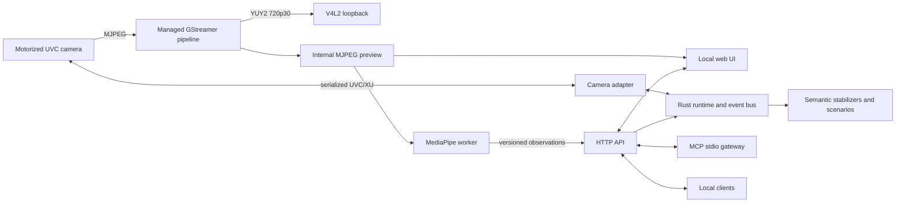

# Tarsier

Tarsier is a local-first control and perception daemon for motorized cameras.
It owns camera capture and vendor control traffic, publishes a stable V4L2
virtual camera, exposes a local API and MCP gateway, and turns MediaPipe
observations into debounced semantic events.

The name comes from the tarsier: a small primate with very large eyes and a
highly mobile head. The project inherits the creature's attentive and slightly
mischievous personality without tying its core to one camera vendor.

> Status: working Linux prototype. The first vertical slice has been exercised
> on an OBSBOT Tiny 2 with live 720p30 video, bounded gimbal control, a generic
> V4L2 consumer, physically validated open-palm activation, supervised local
> perception, HTTP/MCP controls, and the embedded web UI. Camera attitude is
> provenance-labelled, and a conservative libdev-derived telemetry path now
> measures motor/Euler attitude, angular velocity, zoom, tracking, and built-in
> gesture state. See
> [Validation](#validation) and
> [Known limitations](#known-limitations) before relying on it unattended.

## What works

- one Rust daemon owns `/dev/video0` and serializes OBSBOT extension-unit I/O;
- a GStreamer tee feeds an MJPEG preview and `/dev/video42` at 720p30;
- a video supervisor closes stale streams and rebuilds the pipeline against the
  stable device path after runtime errors or end-of-stream;
- generic V4L2 clients can consume `/dev/video42` while perception uses the
  daemon's internal preview branch;
- camera attitude is explicitly labelled `last-commanded`, `measured`,
  `simulated`, or `unavailable` rather than presenting an estimate as fact;
- low-priority camera readback exposes motor and Euler angles, angular velocity,
  zoom magnification, HDR, tracking, and the three built-in gesture switches;
- bounded absolute gimbal moves, continuous held pan/tilt movement, x1-to-x4 zoom,
  HDR, recentering, tracking, named presets, and separate Tiny 2 built-in
  gesture controls are available over HTTP;
- a supervised Python 3.12 worker performs local MediaPipe face landmarking and
  canned gesture recognition for up to two hands;
- face presence and open-palm observations pass through dwell, release, and
  cooldown stabilization before becoming semantic events;
- a responsive local web UI shows the preview, telemetry, perception state,
  presets, scenarios, and recent events, with optional face and two-hand
  skeleton overlays and a direction pad with page-level arrow-key control; it
  reloads its embedded assets after a daemon upgrade and reconnects the MJPEG
  preview after either a pipeline or daemon restart;
- snapshots are available as JPEG over HTTP and as image content over MCP.

OBS, Stream Deck, scripts, and similar tools are possible API clients. OBS is
not a primary product target and is not required by Tarsier.

## Architecture



The process-local bus uses Tokio primitives. External modules communicate
through versioned HTTP schemas; they do not gain direct access to hardware or
the bus. The Python worker receives only downscaled JPEG frames and posts
compact observations back to the loopback-only API.

## Requirements

The current prototype targets Linux and expects:

- a Rust toolchain with edition 2024 support (tested with Rust 1.93);
- Python 3.12 and `uv`;
- GStreamer runtime, base/good plugins, and development headers;
- `v4l2loopback`, `v4l-utils`, and a free virtual device;
- an OBSBOT Tiny 2 reachable through the configured video-device path for the
  real adapter.

On Ubuntu, the native packages can be installed with:

```sh
sudo apt install \
  build-essential pkg-config \
  libgstreamer1.0-dev libgstreamer-plugins-base1.0-dev \
  gstreamer1.0-tools gstreamer1.0-plugins-base \
  gstreamer1.0-plugins-good \
  v4l-utils v4l2loopback-dkms v4l2loopback-utils
```

Load a loopback device matching the example configuration:

```sh
sudo modprobe v4l2loopback video_nr=42 card_label=Tarsier exclusive_caps=1
```

The physical camera and `/dev/video42` must be free before the daemon starts.
The example uses the stable `/dev/v4l/by-id/...-video-index0` camera symlink so
a manual restart still finds the device after USB re-enumeration.

## Quick start

Install the locked Python environment and the pinned MediaPipe model assets:

```sh
uv sync --project worker --locked
uv run --project worker tarsier-perception models --download
```

Validate the configuration, then start Tarsier:

```sh
cargo run -- config --config config/tarsier.example.toml
cargo run -- serve --config config/tarsier.example.toml
```

Open <http://127.0.0.1:8742/> for the embedded preview and controls. In another
terminal, inspect the daemon or consume its public virtual camera. The
**Skeletons** button overlays the detected face mesh and both 21-point hand
skeletons in the UI without modifying the public V4L2 feed. The manual zoom
slider applies x1-to-x4 changes continuously while coalescing obsolete
intermediate positions. Embedded UI assets and the health response use
`Cache-Control: no-store`; an open page detects a new
daemon instance and reloads itself after a restart.

Hold the direction buttons below the preview or use the keyboard arrow keys to
pan and tilt. Arrow keys keep their normal behavior while an input such as the
zoom slider has focus. The page renews a short daemon-owned movement lease while
a direction remains held and stops the motor on release. If the page or network
disappears, the daemon expires the lease and stops the motor automatically.

```sh
cargo run -- status

gst-launch-1.0 v4l2src device=/dev/video42 \
  ! video/x-raw,format=YUY2,width=1280,height=720,framerate=30/1 \
  ! videoconvert ! autovideosink
```

Any V4L2-compatible player may replace the GStreamer command. Tarsier keeps
the loopback output available because its own perception worker reads the
internal MJPEG preview instead.

For a hardware-free smoke run, copy the example configuration and set:

```toml
[video]
source = "test"
loopback_enabled = false

[camera]
adapter = "mock"
```

## Configuration

[`config/tarsier.example.toml`](config/tarsier.example.toml) is the reference
configuration. It defines:

- the loopback-only server address;
- physical and virtual video devices, frame size, rate, preview quality, and
  pipeline recovery delay;
- camera adapter, extension-unit selector, polling cadence, and movement
  limits;
- worker supervision, perception rate, confidence, dwell, release, and
  cooldown thresholds;
- bounded named camera presets;
- event-to-action scenario declarations.

`Recenter` is the camera's native gimbal-zero command. Named presets are
user-defined absolute poses; the reference configuration leaves them empty so
it does not present a redundant `center` preset beside `Recenter`.

Configuration is validated at startup and is not hot-reloaded. The default
camera limit is +/-130 degrees yaw and +/-90 degrees pitch; every HTTP and MCP
move is validated again by the daemon. The `mock` and `disabled` camera
adapters support development without claiming real control hardware.

`camera.poll_interval_ms = 0` disables periodic camera readback. A non-zero
value enables the libdev-derived `AI_GET_GIM_STATE` path at that interval,
labels successful pose samples `measured`, and also schedules lower-rate
gesture status plus selector-6 zoom and tracking readback. The selector-6 zoom
captures AI-driven reframing that the standard V4L2 control can miss. The
reference Tiny 2 configuration uses 1000 ms. Each signal backs off independently
after an error without making camera controls unavailable.

The first scenario action is deliberately small: an activation publishes the
configured action name as a structured `scenario.activated` event. It does not
run arbitrary shell commands or make outbound requests.

## HTTP and WebSocket API

The default server binds only to `127.0.0.1:8742`.

| Method | Path | Purpose |
| --- | --- | --- |
| `GET` | `/api/v1/health` | Health, version, daemon start time, and uptime |
| `GET` | `/api/v1/state` | Complete runtime state |
| `GET` | `/api/v1/config` | Effective configuration |
| `GET` | `/api/v1/camera/state` | Camera availability and attitude |
| `POST` | `/api/v1/camera/move` | Bounded absolute yaw/pitch/roll target |
| `POST` | `/api/v1/camera/nudge/{direction}` | Start or renew `left`, `right`, `up`, or `down` movement; `stop` ends it |
| `POST` | `/api/v1/camera/zoom` | Set x1-to-x4 lens magnification |
| `POST` | `/api/v1/camera/hdr` | Enable or disable HDR/WDR |
| `POST` | `/api/v1/camera/tracking` | Enable or disable built-in tracking |
| `POST` | `/api/v1/camera/built-in-gestures/{feature}` | Enable or disable `target-selection`, `zoom`, or `dynamic-zoom` gestures |
| `POST` | `/api/v1/camera/actions/recenter` | Recenter the gimbal |
| `GET` | `/api/v1/camera/presets` | List configured presets |
| `POST` | `/api/v1/camera/presets/{id}/recall` | Recall a named preset |
| `GET` | `/api/v1/camera/snapshot` | Latest preview frame as JPEG |
| `GET` | `/api/v1/preview.mjpeg` | Multipart MJPEG preview |
| `GET` | `/api/v1/scenarios` | List configured scenarios |
| `POST` | `/api/v1/scenarios/{id}/trigger` | Manually activate a scenario |
| `GET` | `/api/v1/events/recent` | Recent semantic and control events |
| `WS` | `/api/v1/events` | Live event stream |

`POST /api/v1/perception/observations` is the local worker ingestion endpoint.
It is not intended as an operator control.

Examples:

```sh
curl -fsS http://127.0.0.1:8742/api/v1/state

curl -fsS -X POST http://127.0.0.1:8742/api/v1/camera/move \
  -H 'content-type: application/json' \
  -d '{"yaw":-20,"pitch":5,"roll":0}'

curl -fsS -X POST \
  http://127.0.0.1:8742/api/v1/camera/nudge/left

curl -fsS -X POST http://127.0.0.1:8742/api/v1/camera/zoom \
  -H 'content-type: application/json' \
  -d '{"magnification":2.5}'

curl -fsS -X POST \
  http://127.0.0.1:8742/api/v1/camera/built-in-gestures/zoom \
  -H 'content-type: application/json' \
  -d '{"enabled":false}'

curl -fsS http://127.0.0.1:8742/api/v1/camera/snapshot \
  --output snapshot.jpg
```

## MCP gateway

The `tarsier-mcp` binary is a stateless stdio gateway over the daemon's public
API. Start the daemon first, then configure an MCP client to execute:

```sh
cargo run --bin tarsier-mcp -- \
  --daemon-url http://127.0.0.1:8742
```

For a release installation, use the built executable instead:

```text
/absolute/path/to/tarsier-mcp --daemon-url http://127.0.0.1:8742
```

The gateway exposes eleven typed tools:

- read-only: `get_state`, `get_config`, `list_scenarios`, `recent_events`,
  `list_camera_presets`, and `take_snapshot`;
- mutating: `move_camera`, `set_tracking`, `recenter_camera`,
  `recall_camera_preset`, and `trigger_scenario`.

MCP transports commands, state, events, and snapshots, not continuous video.
Movement limits and event recording remain enforced by the daemon regardless
of the MCP client.

## Development and tests

Run the complete automated check set with:

```sh
cargo fmt --all -- --check
cargo clippy --all-targets -- -D warnings
cargo test --all-targets
uv lock --project worker --check
uv run --project worker ruff check worker
uv run --project worker pytest -q worker
node --check web/app.js
```

The worker can exercise face and gesture stabilization deterministically
without camera hardware:

```sh
uv run --project worker tarsier-perception mock --open-palm
```

Protocol construction, CRCs, packet validation, state stabilization, safety
limits, routing, configuration, and MCP negotiation have focused tests. See
[`docs/obsbot-tiny2-protocol.md`](docs/obsbot-tiny2-protocol.md) for the
clean-room interoperability notes behind the first camera adapter.

## Validation

The first vertical slice was validated on 2026-09-05 with an OBSBOT Tiny 2
(USB ID `3564:fef8`, firmware `6.0.10.4`) on Ubuntu 26.04:

- the physical pipeline sustained approximately 30 FPS at 1280x720 with no
  pipeline restart;
- target-selection, zoom, and dynamic-zoom gesture-disable commands were
  accepted while streaming without a pipeline restart or USB re-enumeration;
- standard UVC zoom accepted x2.5 as raw position 50 on the discovered 0-to-100
  range, returned to x1/raw 0, and stayed healthy during live slider updates;
- standard pan/tilt speed controls produced movement on both physical axes and
  used the Tiny 2's verified left/right sign convention;
- a renewed right-movement lease held `pan_speed` continuously at 40 across 16
  hardware reads before an explicit stop returned both motor speeds to zero;
- a single left request showed `pan_speed` -40 after 100 ms and zero by 450 ms,
  validating the daemon-owned 350 ms deadman lease;
- the replacement `AI_GET_GIM_STATE` path returned measured motor/Euler angles
  and angular velocities at 1 Hz while capture remained at approximately 30 FPS;
- periodic readback reported the live x1-to-x4 zoom value, tracking indicator,
  and all three built-in gesture switches with independent timestamps;
- a final five-minute soak collected 30 telemetry samples at ten-second
  intervals while the USB address stayed stable, capture remained near 30 FPS,
  and both pipeline restarts and telemetry errors stayed at zero;
- selector-6 AI zoom initially reported x1.99 and later x1.00 while the standard
  V4L2 zoom control remained at raw 23, confirming that AI zoom readback is
  distinct from the lens-control fallback;
- HDR was switched from its measured enabled state to disabled and back to
  enabled; both transitions were confirmed by selector-6 readback, the USB
  address stayed stable, and the pipeline recovered to 30 FPS without a restart;
- a generic GStreamer V4L2 reader consumed 90 frames from `/dev/video42` and
  exited successfully while preview, perception, and polling continued;
- the camera kept the same USB bus address throughout the initial loopback,
  move, tracking, snapshot, UI, and MCP checks;
- a bounded move and tracking-disable request were accepted, reflected in
  telemetry/state, and recorded on the event bus;
- the then-current MediaPipe worker detected a real face with roughly 10 ms
  processing latency on the tested machine;
- the worker published all 21 normalized landmarks for one real detected hand,
  which the UI drew as a toggleable canvas overlay without re-encoding the
  preview or modifying `/dev/video42`; face-mesh and simultaneous two-hand
  rendering were added afterward and have automated coverage but still need a
  physical visual revalidation;
- a physically held open palm emitted `gesture.open_palm.held` at 67.6%
  confidence after the calibrated 60% trigger threshold and activated the
  configured `open-palm-demo` scenario;
- the HTTP snapshot returned a valid 640x360 JPEG;
- a real MCP stdio client handshake listed all eleven tools and returned both
  live structured camera state and a JPEG snapshot;
- the embedded UI was rendered against the live daemon at desktop size and
  showed the real preview, telemetry, perception health, and events;
- the direction pad and keyboard arrows each emitted a real nudge command, the
  zoom slider retained its own arrow-key behavior, and the controls fit a
  390-pixel mobile viewport without horizontal overflow;
- a page-level Arrow Up hold renewed movement every 100 ms, held `tilt_speed`
  continuously at 30 across 12 hardware reads, and emitted an explicit stop on
  key release;
- one browser tab remained open across a complete daemon stop/start cycle,
  detected the new daemon identity, automatically loaded the newly embedded
  client assets, returned to `Live`, and received a new 640x360 MJPEG stream;
- the video supervisor rebuilt a live synthetic GStreamer pipeline after a
  controlled EOS and recorded both failure and restart events;
- after the repair restart, the real 720p30 pipeline remained healthy for more
  than six minutes on the camera's 480 Mbit/s fallback link, passing 11,000
  frames without another USB event or required restart;
- all 50 daemon tests, 2 MCP tests, 6 Python tests, JavaScript syntax checks,
  formatting, lint, configuration, protocol, and API checks passed.

An extended run changed the camera result: after approximately six minutes of
2 Hz `GIM_GET_STATE` (`0x0043`) queries during streaming, the device disconnected
and re-enumerated on USB. A later disconnect with polling disabled moved the
same camera from its SuperSpeed bus to the companion 480 Mbit/s bus, indicating
that vendor polling is not the only possible source of link loss. The current
video supervisor now rebuilds failed pipelines. The new 1 Hz
`AI_GET_GIM_STATE` (`0x6604`) path follows libdev's serialized command and
decoding behavior and passed a five-minute live soak, but still needs a longer
run before unattended use.

## Known limitations

- only the OBSBOT Tiny 2 and its tested Linux UVC/XU path have a real adapter;
- device discovery is configuration-driven; automatic recovery uses the stable
  configured path and has synthetic EOS coverage, but a physical unplug/reset
  recovery cycle and long soak have not yet been revalidated;
- the V4L2 loopback device must be created before startup;
- absolute movement is safely bounded but has not been calibrated for precise
  agreement between requested and settled angles;
- the previous `0x0043` live attitude query reset the tested camera during an
  extended stream; the libdev-derived `0x6604` replacement has passed a
  five-minute soak but not an unattended endurance run;
- unknown selector-6 AI mode tuples preserve the last confirmed tracking value
  instead of guessing during a firmware transition;
- relative pan/tilt movement briefly clears attitude values until the next
  measured sample reports the final physical angle;
- open-palm thresholds were calibrated for one operator and environment;
  broader lighting, distance, skin-tone, orientation, and operator coverage is
  still required;
- face-mesh and simultaneous two-hand overlays have not yet been visually
  revalidated against the physical camera;
- pipeline telemetry reports effective FPS, frame count, last frame, errors,
  and restart count, but not queue pressure or dropped-frame attribution;
- configuration changes require a restart and runtime state is not persisted;
- the API has no authentication because it binds to loopback only; remote
  exposure is unsupported;
- there is no system service, release packaging, multi-camera support, or
  production soak test yet.

## Product principles and next work

- **Local first:** frames, telemetry, configuration, and perception remain on
  the machine unless an explicit future integration sends data elsewhere.
- **One device owner:** the daemon owns physical capture and proprietary
  control traffic; consumers use the virtual camera or public API.
- **Vendor-independent core:** camera-specific protocols remain behind
  adapters.
- **Stable semantic events:** scenarios consume debounced events, not raw
  landmarks or individual frames.
- **Agent safety:** camera actions are bounded, observable, serialized, and
  explicitly exposed.
- **Headless core:** the daemon and API are the product; the web UI is a local
  control surface.

The next focused increments are extended telemetry and USB recovery soak
testing plus broader gesture robustness testing. Background replacement,
avatars, full-body pose, speech, robotics, ROS, cloud video processing, and a
large gesture vocabulary remain outside the first version.
