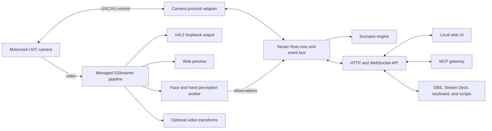

# Tarsier

Tarsier is a local-first control and perception daemon for motorized cameras.
It gives software agents a safe way to observe through a camera, control its
gimbal and tracking features, and react to human face and hand poses.

The name comes from the tarsier: a small primate with very large eyes and a
highly mobile head. The project should inherit the creature's attentive and
slightly mischievous personality without tying itself to one camera vendor.

> Status: product and architecture draft. No implementation has been selected
> as stable yet.

## Initial use cases

The first version is intentionally limited to two use cases:

1. Let an agent inspect and control a motorized camera.
2. Turn face and hand pose observations into reliable scenario triggers.

Examples include asking an agent to frame a person, enabling or disabling
tracking, moving to a calibrated position, taking a snapshot, or triggering an
action after an open-palm gesture has remained stable for a configured time.

Tarsier is initially a local Linux application. A future Raspberry Pi or robot
deployment may influence portability decisions, but robotics, navigation, and
ROS integration are not part of the initial scope.

## Product principles

- **Local first:** video, telemetry, configuration, and perception remain on
  the machine unless an explicit integration sends data elsewhere.
- **One device owner:** one daemon owns camera capture and proprietary control
  traffic so that competing clients do not reset or destabilize the camera.
- **Vendor-independent core:** camera-specific protocols live behind adapters.
- **Stable semantic events:** scenarios consume events such as
  `gesture.open_palm.started`, not raw landmarks or individual video frames.
- **Agent safety:** every camera action is bounded, observable, rate-limited,
  and available through an explicit allowlist.
- **Composable video:** capture, passthrough, transformation, perception, and
  preview are branches of one managed pipeline.
- **Headless by default:** the daemon and CLI are the product core; the web UI
  is an optional local control surface.

## Proposed system shape



The architecture deliberately avoids a distributed message broker in the
first version. The process-local bus should use Tokio primitives:

- `watch` channels for latest-value state such as gimbal attitude and pipeline
  health;
- `broadcast` channels for observations and semantic events;
- `mpsc` plus `oneshot` replies for commands with explicit results.

External modules communicate through versioned API schemas rather than gaining
direct access to the internal bus.

## Main components

### Rust daemon and CLI

The main executable, tentatively `tarsier`, runs the daemon and exposes
operator commands. Likely foundations are Tokio, Axum, Serde, Tracing, Clap,
and `gstreamer-rs`.

Responsibilities:

- own the camera and its control channel;
- run and supervise the video pipeline;
- maintain the current camera, perception, and scenario state;
- enforce command limits and serialize hardware operations;
- expose the local HTTP/WebSocket API;
- persist configuration and calibration;
- publish structured logs and health metrics.

Possible CLI shape:

```text
tarsier serve
tarsier status
tarsier camera state
tarsier camera move --yaw -10 --pitch 2
tarsier tracking enable
tarsier scenario trigger whiteboard
```

The exact command surface should follow the API schema rather than evolve as a
separate control model.

### Camera protocol adapters

The core must not depend on or redistribute a proprietary vendor SDK. The first
adapter may support the OBSBOT Tiny 2 using a clean custom implementation of
the interoperability-relevant UVC extension-unit protocol learned from device
behavior and protocol analysis.

The adapter boundary should cover:

- device discovery and capability reporting;
- wake, sleep, reset, and home operations;
- pan, tilt, roll, and zoom commands where supported;
- tracking enablement and tracking modes;
- current gimbal attitude polling;
- camera modes and image settings exposed by the protocol;
- normalized errors, timeouts, and reconnect behavior.

State polling must be conservative, configurable, and tested for coexistence
with active video capture. A poll failure must never silently trigger a camera
reset. The driver should distinguish an unavailable value from a zero value and
report the source and age of every state sample.

No proprietary shared object, extracted vendor binary, or dependency on a
project that bundles such a binary belongs in the distributable project.
Protocol research notes should record evidence and uncertainty without copying
vendor code.

### Video pipeline

The daemon should open the physical video device once and build a GStreamer
pipeline with a `tee`. Initial branches are:

1. A passthrough or transformed stream written to a V4L2 loopback device, for
   example `/dev/video42`.
2. A lower-resolution perception branch for face and hand analysis.
3. A local preview branch for the web UI.

The device paths, format, resolution, frame rate, and buffering policy must be
configuration values. A sensible initial profile is 720p at 30 FPS, subject to
measurement on the current hardware.

Each branch needs independent queues and back-pressure handling so that a slow
perception worker or browser does not interrupt the virtual camera. Pipeline
telemetry should include negotiated format, effective FPS, dropped frames,
queue pressure, restart count, and last error.

Video transformations should use a plugin-like stage model. Background
replacement, overlays, avatar rendering, and other expensive effects are
future modules, not requirements for the first vertical slice.

### Perception worker

For the first implementation, a small Python worker using MediaPipe is a
pragmatic way to obtain real-time face and hand landmarks while the stable
daemon remains in Rust. The worker receives a downscaled video branch and sends
versioned observations back over local IPC.

Raw observations may contain:

- timestamp and source frame identifier;
- face pose and confidence;
- hand side, landmarks, and confidence;
- recognized candidate gesture;
- processing latency and worker health.

The Rust core converts noisy observations into semantic events using confidence
thresholds, dwell time, hysteresis, debouncing, and cooldowns. This keeps
scenario behavior deterministic and makes the perception implementation
replaceable later.

Initial gesture scope should remain small. One well-tested gesture such as an
open palm is more valuable than a large unreliable gesture vocabulary.

### Scenario engine

A scenario connects a semantic event or API call to one or more named actions.
It should be declarative and inspectable in the web UI.

Example:

```toml
[[scenarios]]
id = "whiteboard"

[scenarios.trigger]
event = "gesture.open_palm.held"
minimum_confidence = 0.85
dwell_ms = 1200
cooldown_ms = 5000

[[scenarios.actions]]
type = "camera.preset"
preset = "whiteboard"
```

Actions may initially invoke camera operations, named HTTP callbacks, or local
commands from an explicit allowlist. Arbitrary shell execution must not be a
default capability.

### HTTP and WebSocket API

The API is the integration boundary for the CLI, web UI, MCP gateway, OBS,
Stream Deck, and local automation.

Candidate resources:

```text
GET  /api/v1/health
GET  /api/v1/camera/state
POST /api/v1/camera/move
POST /api/v1/camera/tracking
POST /api/v1/camera/presets/{id}/recall
POST /api/v1/camera/snapshot
GET  /api/v1/scenarios
POST /api/v1/scenarios/{id}/trigger
GET  /api/v1/config
PATCH /api/v1/config
WS   /api/v1/events
```

The first server should bind to loopback only. Remote binding, authentication,
and authorization require an explicit configuration and threat model.

Stream Deck and OBS integrations should call named API actions. They should not
own the physical camera or reimplement protocol logic.

### MCP gateway

MCP should be a small gateway over the daemon API, not the owner of hardware or
video. This separation lets Tarsier run continuously while agents connect and
disconnect freely.

Candidate tools and resources:

- `camera_get_state`
- `camera_move`
- `camera_set_tracking`
- `camera_recall_preset`
- `camera_snapshot`
- `scenario_list`
- `scenario_trigger`
- recent semantic events and current telemetry as readable resources

MCP is appropriate for snapshots, structured observations, and commands. It is
not the transport for a continuous video stream. An agent can request a fresh
image or subscribe to derived events while the video remains in the managed
pipeline.

Read-only tools and mutating tools must be clearly separated. Movement limits,
tracking changes, and scenario execution should remain subject to daemon-side
policy regardless of the MCP client.

### Web UI

The optional local UI should provide:

- live preview;
- gimbal attitude, zoom, tracking mode, and sample age;
- physical and virtual video device status;
- pipeline FPS, latency, dropped frames, and restart history;
- face and hand overlays for debugging;
- recent semantic events and scenario activity;
- camera presets and calibration controls;
- scenario thresholds, dwell, hysteresis, and cooldown settings;
- configuration import/export and diagnostics.

The UI consumes the public API and must not contain privileged hardware logic.

## Configuration and state

Human-edited configuration should use TOML. Runtime state, calibration, and
logs should live under the standard XDG directories rather than beside source
code.

Likely categories include:

- camera identity and adapter selection;
- safe pan, tilt, zoom, and polling limits;
- video input/output devices and format;
- perception model and thresholds;
- named camera presets;
- scenario definitions;
- local API and access policy;
- logging and telemetry retention.

Configuration changes need validation and an explicit indication of whether
they apply live or require a pipeline restart.

## First vertical slice

The first useful end-to-end milestone is:

1. Start one Rust daemon and claim the configured camera.
2. Capture 720p30 video and keep a V4L2 loopback output alive.
3. Poll gimbal attitude without resetting or interrupting the camera.
4. Display the preview and telemetry in a minimal web page.
5. Expose safe state, movement, tracking, preset, and snapshot operations over
   HTTP and MCP.
6. Detect one face-pose signal and one hand gesture in a supervised worker.
7. Turn the stable gesture into a semantic event and trigger one configured
   scenario.
8. Demonstrate the same scenario through an API call suitable for Stream Deck
   or OBS.

This slice validates the architecture before adding more camera models,
gestures, transforms, audio commands, backgrounds, or avatars.

## Explicit non-goals for the first version

- robot navigation or motor control outside the camera gimbal;
- ROS 2 or another distributed robotics framework;
- cloud video processing;
- continuous raw video transport through MCP;
- a large gesture language;
- speech recognition, voice commands, or speaker identification;
- real-time background replacement or avatar rendering;
- dependence on OBS as the primary compositor;
- bundling or loading a proprietary camera SDK.

These may become modules later, but they must not complicate the initial local
control and pose-trigger loop.

## Open decisions

- Exact internal crate boundaries and workspace layout.
- Whether the first perception transport uses a GStreamer shared-memory branch,
  an app sink bridge, or a dedicated loopback device.
- Browser preview transport: WebRTC, low-latency HLS, or an initial MJPEG
  implementation.
- The first versioned observation and semantic-event schemas.
- How much configuration can be hot-reloaded safely.
- Packaging model for the Python perception worker and MediaPipe assets.
- Test fixtures for protocol packets and recorded video without requiring live
  hardware in every test.
- Licensing and publication strategy.

## Definition of success

Tarsier succeeds when a local agent can safely ask what the camera sees, inspect
its current orientation, change framing or tracking, and react to a deliberate
human gesture while another application consumes a stable virtual-camera feed.
The operator should be able to understand and override all of this from one
local web interface.
