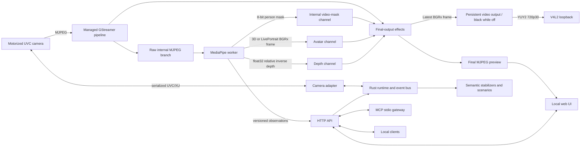

# Tarsier

Tarsier is a local-first control and perception daemon for motorized cameras.
It owns camera capture and vendor control traffic, publishes a stable V4L2
virtual camera, exposes a local API and MCP gateway, and turns MediaPipe
observations into debounced semantic events.

The name comes from the tarsier: a small primate with very large eyes and a
highly mobile head. The project inherits the creature's attentive and slightly
mischievous personality without tying its core to one camera vendor.

> Status: working Linux prototype. The first vertical slice has been exercised
> on an OBSBOT Tiny 2 with live 720p30 video, bounded gimbal control, a generic
> V4L2 consumer, physically validated open-palm activation, supervised local
> perception, HTTP/MCP controls, and the embedded web UI. Camera attitude is
> provenance-labelled, and a conservative libdev-derived telemetry path now
> measures motor/Euler attitude, angular velocity, zoom, tracking, and built-in
> gesture state. See
> [Validation](#validation) and
> [Known limitations](#known-limitations) before relying on it unattended.

## What works

- one Rust daemon owns `/dev/video0` and serializes OBSBOT extension-unit I/O;
- a GStreamer pipeline keeps a raw internal perception branch separate from
  the final MJPEG preview and `/dev/video42` output at 720p30;
- a video supervisor closes stale streams and rebuilds the pipeline against the
  stable device path after runtime errors or end-of-stream;
- the camera Power switch releases physical capture before putting the OBSBOT
  to sleep, then wakes it before rebuilding capture, while the daemon and UI
  remain available throughout; the supervised perception worker pauses while
  frames are unavailable and starts again after capture resumes;
- generic V4L2 clients can consume `/dev/video42` while perception uses the
  daemon's internal preview branch;
- camera attitude is explicitly labelled `last-commanded`, `measured`,
  `simulated`, or `unavailable` rather than presenting an estimate as fact;
- low-priority camera readback exposes motor and Euler angles, angular velocity,
  zoom magnification, HDR, tracking, and the three built-in gesture switches;
- bounded absolute gimbal moves, continuous held pan/tilt movement, x1-to-x4 zoom,
  HDR, recentering, tracking, named presets, and separate Tiny 2 built-in
  gesture controls are available over HTTP;
- optional Tarsier face tracking follows the detected face with proportional,
  ramped gimbal movement, falls back to calibrated visible shoulders when the
  face mesh disappears, and switches exclusively with the camera's built-in
  tracking; optional auto zoom calibrates the current face size, then adjusts
  the x1-to-x4 zoom conservatively to preserve that framing;
- optional Tarsier hands tracking slowly frames up to two detected hands and
  adjusts zoom only while both remain visible. If one hand disappears, it
  immediately follows the remaining hand with pan/tilt while freezing zoom; a
  rapidly moving remaining hand or loss of both hands stops camera motion
  instead of chasing them out of frame;
- a supervised Python 3.12 worker performs local MediaPipe face and body-pose
  landmarking and canned gesture recognition for up to two hands at a bounded
  observation rate, while a dedicated selfie segmenter publishes person masks
  at the video rate and a widened pose silhouette rejects attached background
  objects without clipping normal inter-frame motion;
- a reusable internal 8-bit video-mask channel feeds a final-output effects
  stage; the **Background** switch enables one exclusive effect at a time:
  **Green screen** replaces the background with green, while **Blur** keeps the
  subject sharp and softens the background, and **Pixel Party** replaces the
  room with an art-directed pixelated studio on a calm 24-second loop. All
  three affect the preview and virtual camera using exact source-PTS pairing
  and a narrow edge transition. When
  depth is enabled, the worker combines MediaPipe's semantic person
  probability with the local depth distribution to suppress background leaks
  at depth breaks. The output branch waits for the mask generated from the
  same camera frame; a missing or stale mask freezes the last processed image
  (black until the first valid image);
- an optional local avatar worker defaults to a cel-shaded procedural 3D head
  and bust driven by MediaPipe head pose and facial blendshapes; LivePortrait
  remains an alternate engine. Both publish complete BGRx scenes to the same
  preview and virtual-camera output. The **Video identity** control switches
  between the real camera and avatar; a missing or stale avatar frame freezes
  the last generated image, with black only before the first valid image;
- an optional local Depth Anything V2 worker estimates relative monocular depth
  on demand for either **Depth map** or Camera's active background effect.
  Tarsier retains the original `float32` field for machine use, independently
  colorizes it for the depth identity, and uses only its likelihood as a
  boundary refinement for person segmentation;
- face presence and open-palm observations pass through dwell, release, and
  cooldown stabilization before becoming semantic events;
- a responsive local web UI shows the preview, telemetry, perception state,
  presets, scenarios, and recent events, with optional face, body, and two-hand
  skeleton overlays, physical camera power, face or hands tracking, and a direction pad
  with page-level arrow-key control; manual movement disables whichever
  tracking mode owns the gimbal, and the UI reloads its embedded assets after a
  daemon upgrade and reconnects the MJPEG preview after either a pipeline or
  daemon restart;
- snapshots are available as JPEG over HTTP and as image content over MCP.

OBS, Stream Deck, scripts, and similar tools are possible API clients. OBS is
not a primary product target and is not required by Tarsier.

## Architecture



The process-local bus uses Tokio primitives. External modules communicate
through versioned HTTP schemas; they do not gain direct access to hardware or
the bus. The Python worker receives only downscaled raw-camera JPEG frames and
posts compact observations, person masks, and optional relative-depth fields
back to the API over loopback.

## Requirements

The current prototype targets Linux and expects:

- a Rust toolchain with edition 2024 support (tested with Rust 1.93);
- Python 3.12 and `uv`;
- GStreamer runtime, base/good plugins, and development headers;
- FFmpeg with the `libx264` encoder for video recording;
- `v4l2loopback`, `v4l-utils`, and a free virtual device;
- an OBSBOT Tiny 2 reachable through the configured video-device path for the
  real adapter.

On Ubuntu, the native packages can be installed with:

```sh
sudo apt install \
  build-essential pkg-config \
  libgstreamer1.0-dev libgstreamer-plugins-base1.0-dev \
  gstreamer1.0-tools gstreamer1.0-plugins-base \
  gstreamer1.0-plugins-good \
  v4l-utils v4l2loopback-dkms v4l2loopback-utils
```

Load a loopback device matching the example configuration:

```sh
sudo modprobe v4l2loopback video_nr=42 'card_label=Tarsier Camera' exclusive_caps=1
```

The physical camera and `/dev/video42` must be free before the daemon starts.
The example uses the stable `/dev/v4l/by-id/...-video-index0` camera symlink so
a manual restart still finds the device after USB re-enumeration.

## Quick start

Install the locked Python environment, local OpenGL renderer, depth runtime,
and pinned MediaPipe and Depth Anything V2 model assets:

```sh
uv sync --project worker --extra avatar --extra depth --locked
uv run --project worker --extra avatar --extra depth --locked \
  tarsier-perception models --download --avatar --depth
```

Validate the configuration, then start Tarsier:

```sh
cargo run -- config --config config/tarsier.example.toml
cargo run -- serve --config config/tarsier.example.toml
```

Open <http://127.0.0.1:8742/> for the embedded preview and controls. In another
terminal, inspect the daemon or consume its public virtual camera. The
**Skeletons** button overlays the detected face mesh, a 33-point body pose, and
both 21-point hand skeletons in the UI without modifying the public V4L2 feed.
The **Background** switch below the pan/tilt controls applies the exclusively
selected **Green screen**, **Blur**, or **Pixel Party** effect to both the
embedded preview and `/dev/video42`, so conferencing applications consume the
same final image.
Green screen replaces detected background pixels with solid green. Blur builds
a reduced, softened background image and composites the original sharp subject
over it with the same person mask. Pixel Party replaces the room with a bundled,
art-directed pixelated studio containing a desk, monitor, shelves, lamps, plants,
and layered lounge decor. The teal, indigo, plum, wood, and amber scene animates
only its monitor glow, practical lamp, and a few distant highlights on a gentle
24-second loop while leaving the subject untouched. While any effect is active,
Tarsier freezes the last successfully processed image if the worker has not
published a fresh mask. It resumes when a matching fresh mask arrives. Before
the first valid image, or after changing the effect, identity, or dimensions,
it emits black; it never exposes unprocessed camera pixels as a fallback.
The final stream is held for one frame so the inferred mask remains aligned
during subject or camera motion. Disabling the switch restores the original
image without changing the public virtual-camera device. The reference camera
configuration starts Green screen enabled and therefore emits black, never the
unprocessed frame, while the first mask is still pending after a restart. The
previous `/api/v1/video/green-screen` endpoint remains available for compatible
clients and selects Green screen when called. With `[depth].enabled = true`,
Camera plus an active background effect also loads Depth Anything V2. The
semantic mask still decides what is a person; a temporally smoothed depth
likelihood sharpens uncertain boundary pixels and rejects differently distanced
background fragments. Turning the background effect off releases the depth
model unless the Depth map identity is selected.

The video button beside the microphone mute button masks the virtual camera
output while keeping capture and the local preview active. The virtual camera
starts muted and stays muted while no application is confirmed connected.
After connecting a conference application, unmute manually when ready.
Disconnecting the last client mutes the output again; reconnecting never
unmutes it. Idle checks run every 250 ms. This pre-mutes ordinary new sessions,
but an extremely fast disconnect/reconnect can still occur between checks.
Recording remains available while the virtual camera is idle and muted. New settings use a
built-in Tarsier logo image by default. In **Settings →
Video → Video mute replacement**, upload a PNG/JPEG image or MP4/WebM video (up to
100 MB), restore **Use Tarsier image**, or choose **Use black output**. Replacements fit inside the output
frame without cropping or distortion. Videos loop without audio, pause when
output is unmuted, and restart on the next mute. Imported media is kept in a local library, so switching to Tarsier, black output
or another saved image or video does not delete it. Use **Delete selected** to
remove a library item; deleting the active item restores the default Tarsier image.
The library, selected file and mute state survive daemon restarts and camera
power cycles. Existing selected custom media is retained in the library.
If a replacement cannot be loaded or played, muted output stays black.
Tarsier recordings and preview photos use the real processed camera image,
including its effects, independently of the video output mute. This lets you
record a new welcome clip while a replacement is shown in your conference.

Scroll over the preview or pinch with two fingers to zoom from x1 to x4.
One-finger dragging still pans and tilts; pinching stops that movement.
The zoom slider applies x1-to-x4 changes continuously while coalescing obsolete
intermediate positions. With Face tracking active, the **Auto zoom** switch next
to the face-tracking and pan/tilt controls captures the face's current on-screen
size and holds it with smoothed, rate-limited corrections. Moving the slider
while Auto zoom is active pauses correction while the lens settles, then makes
the resulting face size the new target. Embedded UI assets and the
health response use `Cache-Control: no-store`; an open page detects a new daemon
instance and reloads itself after a restart. When Tarsier runs under a service
supervisor, the **Live** status is also a button: it opens a confirmation dialog
before requesting a graceful daemon restart. Manual foreground runs keep the
indicator read-only so a restart request cannot become an accidental stop.

Click the resolution link beside **Preview** to select 1280×720, 1920×1080,
or 3840×2160 (4K). The choice is persisted and applied through a supervised
daemon restart; the page reconnects automatically. In 4K, output uses the real
camera with background effects, avatar/depth output, rotation, and output
mirroring disabled. Select a lower resolution to enable those controls again.
The browser preview remains downscaled; the virtual camera output and photos
use the selected full resolution.

Tarsier atomically persists the selected video identity, background switch and
effect, exclusive Face or Hands tracking preference, and dependent Auto zoom preference in
`$XDG_STATE_HOME/tarsier/user-settings.json`, or
`~/.local/state/tarsier/user-settings.json` when `XDG_STATE_HOME` is unset.
`TARSIER_USER_SETTINGS_PATH` can override the exact file path. The saved video
identity is loaded before the pipeline starts: restoring an avatar or depth
output therefore emits the existing black privacy fallback until its first
fresh generated frame, never an intermediate real-camera frame. A malformed or
unsupported settings file prevents startup instead of falling back to Camera.

The **Video identity** selector switches the complete final stream among
**Camera**, **Depth map**, **Personal 3D**, and **LivePortrait**. Neural engines
load on demand and release their GPU resources when another identity is
selected. Depth map runs Depth Anything V2 Small against the same raw camera
branch as perception. Its source values are retained as a two-dimensional
little-endian `float32` relative inverse-depth field: larger values are nearer,
but they are not distances in metres. A slowly stabilized percentile range is
used only for the false-color video, so display contrast changes do not alter
the machine-readable values available from `GET /api/v1/depth/frame`.

Selecting an alternate identity replaces the whole image in both
the web preview and `/dev/video42`. Personal 3D (`portrait3d`) loads a local scanned portrait and supplies a synchronized
alpha silhouette to the background stage. Green screen and Pixel Party can
replace its backdrop; Off and Blur use a neutral synthetic background. Other
alternate identities already contain a complete background. See
[the portrait asset workflow](assets/avatars/portrait/README.md) for updates. A switch
immediately clears the previous generated frame, and Tarsier accepts new frames
only for the selected identity. If initialization or inference takes more than
500 ms, it holds the last successfully generated image until a fresh matching
frame arrives. Before the first valid image for the selected identity it outputs
black; it never falls back to the real camera. Depth map uses the same behavior.

LivePortrait remains an experimental fallback. Because it animates one frontal
source rather than a multi-view identity model, Tarsier attenuates and bounds
head rotation to the source's reliable near-frontal range. The driving crop and
transferred head pose are smoothed independently, while global scale and
translation stay anchored to the source portrait so detector noise cannot make
the avatar bounce. The supervised worker installs both optional dependency
groups and verifies the additional local weights at startup, but imports
PyTorch and loads the neural models only after LivePortrait is selected.
Download the weights with `models --download --avatar`. A fictional adult portrait
is bundled at `assets/avatars/liveportrait-default.png`, so no personal image is
needed on a fresh checkout. See [avatar provenance and usage](assets/avatars/README.md).
Use the folder icon on the **LivePortrait** card to browse a thumbnail gallery of
PNG/JPEG images in `assets/avatars/`. The current portrait is marked. Select a
thumbnail and choose **Use this avatar** to save its path and prepare it in the
running worker. The old portrait continues to animate while the new source features
are prepared using the already loaded neural weights. The first complete new frame
replaces it atomically; preparation is not instantaneous, but the video and audio
pipelines are not restarted. Failed preparation keeps the old avatar visible and
reports an error. Existing portraits beside the user settings (under `portraits/`)
and the currently configured source are included too. The listing is refreshed on
each open, excludes nested directories and directory-entry symlinks, and does not
copy or modify portraits. Image previews are decoded locally with bounded sizes.
The selected path persists across restarts, takes precedence over
`avatar.source_image`, and keeps the video identity unchanged. Avatar changes also
work while recording. Remove `liveportrait_source` from the user
settings while Tarsier is stopped to return to the configured source.

Set `avatar.source_image` to a custom local path to use your own portrait; explicit
settings (including the older `assets/avatars/liveportrait-source.png` path) remain
unchanged. Other PNG portraits in `assets/avatars/` stay ignored by Git.
LivePortrait still requires its optional dependencies, model weights, and a
CUDA-capable GPU. Its first compiled inference may take roughly
one minute on the tested RTX 3070 while PyTorch builds and caches GPU kernels.

Hold the direction buttons below the preview or use the keyboard arrow keys to
pan and tilt. Arrow keys keep their normal behavior while an input such as the
zoom slider has focus. The page renews a short daemon-owned movement lease while
a direction remains held and stops the motor on release. If the page or network
disappears, the daemon expires the lease and stops the motor automatically.
The **Face tracking** control below the preview uses the same movement lease at
a proportional speed with acceleration and deceleration ramps. Enabling it
first disables the camera's built-in tracking; enabling built-in tracking stops
Tarsier face tracking. The detected face is the preferred target. While face
and pose are both visible, their vertical offset is calibrated continuously;
when the face disappears, stable shoulders therefore preserve the inferred
head height instead of causing a tilt jump. Manual pan, tilt, recenter, and
preset controls stop either tracking mode before moving and remain available
whenever the camera is connected. Auto zoom requires Face tracking and a valid
face mesh. It measures the horizontal face-mesh span, smooths it, starts
correcting beyond 6%, and derives one zoom destination from the observed size
ratio. When the face mesh disappears, any pending zoom destination is cancelled,
the size filter is reset, and zoom remains frozen until a valid face mesh
returns. Shoulder fallback remains available for pan and tilt but never affects
zoom. The controller approaches each destination with proportional bounded
steps, abandons it immediately when the observed size requires the opposite
direction, and briefly waits for the image to settle before reassessing. It
reports when the x1 or x4 bound prevents preserving the calibrated size.
Disabling Face tracking also disables Auto zoom.

The separate **Hands tracking** control is exclusive with Face tracking and the
camera's built-in tracking. With two hands visible, it slowly centers their
combined bounds and preserves their calibrated on-screen span with conservative,
rate-limited zoom. As soon as only one hand remains, zoom freezes and pan/tilt
follows that hand immediately. Fast hand motion freezes all camera movement so a
deliberately withdrawn hand is not chased; losing both hands also stops the
gimbal. Manual movement, recentering, and preset recall stop Hands tracking in
the same way as the other tracking modes.

```sh
cargo run -- status

gst-launch-1.0 v4l2src device=/dev/video42 \
  ! video/x-raw,format=YUY2,width=1280,height=720,framerate=30/1 \
  ! videoconvert ! autovideosink
```

Any V4L2-compatible player may replace the GStreamer command. Tarsier keeps
the loopback output available because its own perception worker reads the
internal MJPEG preview instead.

For a hardware-free smoke run, copy the example configuration and set:

```toml
[video]
source = "test"
loopback_enabled = false

[camera]
adapter = "mock"
```

## Configuration

[`config/tarsier.example.toml`](config/tarsier.example.toml) is the reference
configuration. It defines:

- the server listen address;
- physical and virtual video devices, frame size, rate, preview quality,
  initial video identity, background-effect state and selection, and pipeline
  recovery delay;
- camera adapter, extension-unit selector, polling cadence, and movement
  limits;
- worker supervision, independent landmark and person-mask rates, confidence,
  dwell, release, and cooldown thresholds;
- optional relative-depth inference cadence and multiple-of-14 input height;
- optional avatar engine, 3D color profile or LivePortrait source image,
  target cadence, and LivePortrait compilation;
- bounded named camera presets;
- event-to-action scenario declarations.

`Recenter` is the camera's native gimbal-zero command. Named presets are
user-defined absolute poses; the reference configuration leaves them empty so
it does not present a redundant `center` preset beside `Recenter`.

Configuration is validated at startup and is not hot-reloaded. The default
camera limit is +/-130 degrees yaw and +/-90 degrees pitch; every HTTP and MCP
move is validated again by the daemon. The `mock` and `disabled` camera
adapters support development without claiming real control hardware.

`camera.poll_interval_ms = 0` disables periodic camera readback. A non-zero
value enables the libdev-derived `AI_GET_GIM_STATE` path at that interval,
labels successful pose samples `measured`, and also schedules lower-rate
gesture, image-setting, and selector-6 status readback. With the reference
1000 ms polling interval, image settings refresh every five seconds and
immediately after a write. The selector-6 zoom captures AI-driven reframing
that the standard V4L2 control can miss. Proprietary telemetry signals back off
independently after an error, while standard-control failures remain attached
to their individual controls without making the rest unavailable.

The first scenario action is deliberately small: an activation publishes the
configured action name as a structured `scenario.activated` event. It does not
run arbitrary shell commands or make outbound requests.

## HTTP and WebSocket API

Video orientation controls select a clockwise rotation of 0, 90, 180, or 270
degrees and an independent horizontal mirror applied after rotation. The
transformation runs after output effects and before the shared preview/virtual
camera branches, including avatar and depth output. The output dimensions stay
fixed: quarter turns fit the whole image with black borders, without stretching
or cropping. The selection is persisted across daemon restarts.

`GET /api/v1/video/transform` reads `{ "rotation": 0, "mirror": false }`;
`POST` to the same endpoint replaces both values and emits `video.transform`.
Runtime state exposes the selection as `video_effects.transform`.

The **Mirror preview** button flips only the browser preview and its skeleton
overlay. This preference is saved in the current browser, independently of
**Mirror output**; virtual-camera output and saved photos are unaffected.
UI arrows use the displayed image's axes and skeleton overlays follow the same
transform.
The perception MJPEG feed carries `X-Tarsier-Inference-Rotation` on every frame.
The worker rotates the image before face/hand/pose inference and segmentation,
without letterboxing or mirroring, then maps landmarks and masks back to source
coordinates. Local tracking and output overlays retain that source coordinate
contract. Camera mounting
orientation telemetry and automatic orientation scenarios are not implemented.

The default binds to `127.0.0.1:8742`. Open **Settings** in the UI and select
**Local network**, then **Save and restart**, to listen on all IPv4 interfaces
(`0.0.0.0`). The choice is persisted and overrides the configuration's bind IP.
The port stays as configured. From a laptop on the same network, open
`http://<camera-host-LAN-IP>:8742/` for the preview and controls. The perception
worker still connects over loopback. Select **Local only** to disable remote
access. Network changes require supervision and are blocked while recording.

Authentication is optional. Until a master password is set, anyone able to
reach the port can view video, access saved media, and control the daemon.
Configure access protection in **Settings** before sharing access. Folder
buttons act on the camera host's desktop, even from another computer.

### Master password and client tokens

In **Settings → Access protection**, set, change, or disable the master
password. The first password must be set from the camera computer over a
loopback connection, or with the local CLI. Once set, protection applies
immediately to all operator API routes, media, MJPEG, and WebSocket streams.
The login page, static UI assets, and authentication status remain public.
There are no user accounts.

Web clients sign in with the master password and receive a 12-hour HttpOnly,
SameSite=Strict session cookie (also Secure when signing in over HTTPS).
Passwords use salted Argon2id hashes. Password changes invalidate all previous
web sessions but preserve client tokens. Sessions survive daemon restarts until
their original expiration; only hashed session tokens are stored in the protected
authentication file. Signing in opens
the main control page.
Disabling protection revokes all tokens and makes the API public again.

In **Settings → Client tokens**, create a named token for each client, such as
Stream Deck or an MCP agent. Select **API**, **MCP**, or both; at least one
destination is required. Destinations are immutable: revoke and replace a token
to change its access. Existing tokens without destinations default to API only.
Only a master-password browser session can create or revoke tokens; client
tokens cannot administer other tokens. Copy each token when created: only its
SHA-256 hash is stored, and the secret cannot be displayed again. Revoke a token
to remove that client's access. Existing MJPEG and WebSocket connections recheck
authorization every second. In-flight commands cannot be undone by revocation.

Send client tokens in `Authorization: Bearer <token>`, never in a URL:

```sh
curl -fsS http://127.0.0.1:8742/api/v1/state \
  -H "Authorization: Bearer $TARSIER_API_TOKEN"
```

Set `TARSIER_MCP_TOKEN` in the environment of `tarsier-mcp`, and
`TARSIER_API_TOKEN` for `tarsier status` or a manually launched perception worker.
The MCP gateway also accepts `TARSIER_API_TOKEN` as a legacy environment variable
name, but the token must still have the MCP destination. The daemon automatically
provisions its supervised worker with an ephemeral credential restricted to
perception input/output and reading the selected video identity. It keeps working when
protection is enabled, without a manually created token.

For forgotten-password recovery, run the CLI as the same OS user as the daemon:

```sh
tarsier auth set-password
```

This prompts twice without echoing the password. It sets or resets the master
password without requiring the old password, takes effect without restarting,
and preserves API tokens. To explicitly remove all protection and revoke tokens:

```sh
tarsier auth disable --confirm
```

Credentials are written atomically with mode `0600` to `auth.json` beside the
user settings file, normally `~/.local/state/tarsier/auth.json`. Set
`TARSIER_AUTH_PATH` to override this location; daemon and CLI must use the same
path. A malformed authentication file fails closed.

HTTP does not encrypt passwords, cookies, or tokens. Use HTTPS through a
reverse proxy or an encrypted tunnel on untrusted networks. A proxy must
preserve the public Host header for same-origin checks. Do not expose the
plain HTTP listener to the public Internet.

| Method | Authentication path | Purpose |
| --- | --- | --- |
| `GET` | `/api/v1/auth/status` | Protection enabled and current browser admin-session status |
| `POST` | `/api/v1/auth/login` | Sign in with `{ "password": "…" }` |
| `POST` | `/api/v1/auth/logout` | End the current browser session |
| `POST` | `/api/v1/auth/password` | Set/change password; include `current_password` when enabled; an empty new password disables protection |
| `GET` / `POST` | `/api/v1/auth/tokens` | List tokens or create one with `{ "name": "Stream Deck" }`; requires a master session |
| `POST` | `/api/v1/auth/tokens/{id}/revoke` | Revoke a token; requires a master session |

Authentication POST routes require `X-Tarsier-Request: 1` and JSON. Browser
requests must be same-origin. Login attempts are throttled to one per second.

### Operator routes

| Method | Path | Purpose |
| --- | --- | --- |
| `POST` | `/api/v1/camera/photos` | Save the final full-resolution JPEG locally; returns its path and URL |
| `GET` | `/api/v1/camera/photos/{filename}` | Open a saved photo as a JPEG |
| `POST` | `/api/v1/camera/photos/{filename}/open` | Show a saved photo in its folder, selected in the file manager; send an empty JSON object |
| `GET` / `POST` | `/api/v1/settings/network` | Read network settings or persist `{ "lan_access": true }` and restart |
| `GET` | `/api/v1/health` | Health, version, daemon start time, uptime, and restart availability |
| `GET` / `POST` | `/api/v1/video/liveportrait/source` | List local portraits or select one by `{ "id": "…" }` without restarting media |
| `GET` | `/api/v1/video/liveportrait/source/{id}` | Locally decoded thumbnail for a catalogued portrait |
| `GET` / `POST` | `/api/v1/video/liveportrait/status` | Read requested/active source revisions or report a worker preparation error |
| `POST` | `/api/v1/daemon/restart` | Gracefully exit for restart by the active service supervisor |
| `POST` | `/api/v1/video/resolution` | Persist `{ "width": 3840, "height": 2160 }` (also 720p/1080p) and restart under supervision; 4K disables effects |
| `GET` | `/api/v1/state` | Complete runtime state |
| `GET` | `/api/v1/video/applications` | Local processes with the virtual camera open; cached for two seconds |
| `GET` | `/api/v1/config` | Effective configuration |
| `GET` | `/api/v1/camera/state` | Camera availability, attitude, and typed image-setting readback |
| `POST` | `/api/v1/camera/power` | Wake or sleep the physical camera while keeping the daemon available |
| `POST` | `/api/v1/camera/move` | Bounded absolute yaw/pitch/roll target |
| `POST` | `/api/v1/camera/nudge/{direction}` | Start or renew `left`, `right`, `up`, or `down` movement; `stop` ends it |
| `POST` | `/api/v1/camera/zoom` | Set x1-to-x4 lens magnification |
| `POST` | `/api/v1/camera/image-settings/{control}` | Set one advertised image control with `{"value": integer}` and verify its readback |
| `POST` | `/api/v1/camera/auto-zoom` | Preserve the current detected-face size while face tracking is active |
| `POST` | `/api/v1/camera/hdr` | Enable or disable HDR/WDR |
| `POST` | `/api/v1/camera/tracking` | Enable or disable built-in tracking |
| `POST` | `/api/v1/camera/face-tracking` | Enable or disable Tarsier face tracking |
| `POST` | `/api/v1/camera/hands-tracking` | Enable or disable slow two-hand framing with one-hand zoom freeze |
| `GET`, `POST` | `/api/v1/video/identity` | Read or select `camera`, `depth-map`, `portrait3d`, or `liveportrait` |
| `POST` | `/api/v1/video/output-mode` | Compatibility selector for the underlying output mode |
| `POST` | `/api/v1/video/background` | Enable one final-output background effect with `{"enabled": bool, "effect": string}`; accepted effects are `green-screen`, `blur`, and `pixel-party` |
| `POST` | `/api/v1/video/green-screen` | Compatibility control that selects and enables or disables Green screen |
| `GET` | `/api/v1/depth/frame` | Latest raw relative inverse-depth field as little-endian `float32`, with dimensions and provenance in headers |
| `POST` | `/api/v1/camera/built-in-gestures/{feature}` | Enable or disable `target-selection`, `zoom`, or `dynamic-zoom` gestures |
| `POST` | `/api/v1/camera/actions/recenter` | Recenter the gimbal |
| `GET` | `/api/v1/camera/presets` | List configured presets |
| `POST` | `/api/v1/camera/presets/{id}/recall` | Recall a named preset |
| `GET` | `/api/v1/camera/snapshot` | Latest preview frame as JPEG |
| `GET` | `/api/v1/preview.mjpeg` | Multipart MJPEG preview |
| `GET` | `/api/v1/scenarios` | List configured scenarios |
| `POST` | `/api/v1/scenarios/{id}/trigger` | Manually activate a scenario |
| `GET` | `/api/v1/events/recent` | Recent semantic and control events |
| `WS` | `/api/v1/events` | Live event stream |

`GET /api/v1/perception/input.mjpeg`, `POST /api/v1/perception/observations`,
`POST /api/v1/perception/mask`, `POST /api/v1/avatar/frame`, and
`POST /api/v1/depth/frame` are local worker endpoints. The first keeps
inference on the raw camera image, while the others publish derived values and
frames. They are not operator controls. The depth `GET` route is the public raw
data view of the most recently accepted field.

Examples:

```sh
curl -fsS http://127.0.0.1:8742/api/v1/state

curl -fsS -X POST http://127.0.0.1:8742/api/v1/camera/power \
  -H 'content-type: application/json' \
  -d '{"enabled":false}'

curl -fsS -X POST http://127.0.0.1:8742/api/v1/camera/move \
  -H 'content-type: application/json' \
  -d '{"yaw":-20,"pitch":5,"roll":0}'

curl -fsS -X POST \
  http://127.0.0.1:8742/api/v1/camera/nudge/left

curl -fsS -X POST http://127.0.0.1:8742/api/v1/camera/zoom \
  -H 'content-type: application/json' \
  -d '{"magnification":2.5}'

curl -fsS -X POST http://127.0.0.1:8742/api/v1/camera/image-settings/brightness \
  -H 'content-type: application/json' \
  -d '{"value":60}'

curl -fsS -X POST \
  http://127.0.0.1:8742/api/v1/camera/built-in-gestures/zoom \
  -H 'content-type: application/json' \
  -d '{"enabled":false}'

curl -fsS http://127.0.0.1:8742/api/v1/camera/snapshot \
  --output snapshot.jpg
```

## MCP gateway

The `tarsier-mcp` binary is a stateless stdio gateway over the daemon's public
API. Start the daemon first, then configure an MCP client to execute:

```sh
cargo run --bin tarsier-mcp -- \
  --daemon-url http://127.0.0.1:8742
```

For a release installation, use the built executable instead:

```text
/absolute/path/to/tarsier-mcp --daemon-url http://127.0.0.1:8742
```

The gateway exposes fifteen typed tools:

- read-only: `get_state`, `get_camera_position`, `get_config`, `list_scenarios`, `recent_events`,
  `list_camera_presets`, and `take_snapshot`;
- mutating: `move_camera`, `set_camera_tracking`, `set_face_tracking`,
  `set_auto_zoom`, `set_zoom`, `recenter_camera`, `recall_camera_preset`, and `trigger_scenario`.

Use `set_face_tracking` by default for Tarsier face/shoulder framing, or
`set_camera_tracking` when smoother built-in camera movement is preferred.
Enabling either tracking mode disables the other. Auto zoom is a separate,
explicit choice through `set_auto_zoom` and requires face tracking first.
The old MCP tool name `set_tracking` is removed without an alias.
Call `move_camera` with `{"yaw": 20, "pitch": -10, "zoom": 2.0}` to set
orientation and zoom together. Omit `zoom` to preserve its current value. All
values are validated before changing tracking or issuing hardware commands.
Orientation and zoom are applied sequentially, not atomically; a zoom failure
after movement is reported explicitly with `orientation_commanded: true`.
`get_camera_position` returns the latest known `pan_degrees`, `tilt_degrees`,
and `zoom_magnification`, their sources, timestamps and telemetry errors.
Unknown values are null. A `last-commanded` source is a target, not confirmation
that physical motion has completed.

For manual zoom, call `set_zoom` with `{"magnification": 2.0}` for 2x zoom.
The accepted range is 1.0 to 4.0. Manual zoom does not enable tracking or auto
zoom; an already-active auto zoom recalibrates to the new framing.

MCP transports commands, state, events, and snapshots, not continuous video.
The gateway uses dedicated `/mcp/api/v1/...` routes for its fifteen operations.
Tokens need the MCP destination on these routes and the API destination on
regular API routes. Destination checks use the route, not a client-supplied
header. These are internal HTTP routes for the stdio gateway, not a separate
HTTP MCP transport. The daemon rejects MCP mutations with HTTP 409 while the virtual camera has an active
capture or a detected external open handle. This covers movement, recentering,
preset recall, tracking changes, and scenario triggers. Read-only tools remain available;
manual UI controls and existing automatic tracking are unaffected. Each command
reads a fresh `V4L2_EVENT_PRI_CLIENT_USAGE` event from v4l2loopback, requesting
the initial state so already-running captures are detected too. This driver
signal detects active capture even when its process cannot be inspected, and
reports activity rather than an exact client count. A fresh process scan also
detects open handles before capture starts; it covers inspectable processes
owned by the daemon's user and excludes the daemon and its descendants. Neither
check uses the UI's two-second cache. Inspection errors or an unavailable driver
signal on an existing device block mutations with HTTP 503. The applications
API exposes `capture_active` as true, false, or null (unknown). This is a
command-time guard, not a stop for motion already in progress.
Movement limits and event recording remain enforced by the daemon regardless
of the MCP client.

## Development and tests

Run the complete automated check set with:

```sh
cargo fmt --all -- --check
cargo clippy --all-targets -- -D warnings
cargo test --all-targets
uv lock --project worker --check
uv run --project worker ruff check worker
uv run --project worker pytest -q worker
node --check web/app.js
```

The worker can exercise face and gesture stabilization deterministically
without camera hardware:

```sh
uv run --project worker tarsier-perception mock --open-palm
```

Protocol construction, CRCs, packet validation, state stabilization, safety
limits, routing, configuration, and MCP negotiation have focused tests. See
[`docs/obsbot-tiny2-protocol.md`](docs/obsbot-tiny2-protocol.md) for the
clean-room interoperability notes behind the first camera adapter.

## Validation

The first vertical slice was validated on 2026-09-05 with an OBSBOT Tiny 2
(USB ID `3564:fef8`, firmware `6.0.10.4`) on Ubuntu 26.04:

- the physical pipeline sustained approximately 30 FPS at 1280x720 with no
  pipeline restart;
- a live Power off/on cycle kept the same daemon process and healthy loopback
  API, stopped capture at 0 FPS without recording a pipeline error or restart,
  intentionally paused the perception worker, then returned to 29.98 FPS with
  a fresh worker and a successful JPEG snapshot;
- target-selection, zoom, and dynamic-zoom gesture-disable commands were
  accepted while streaming without a pipeline restart or USB re-enumeration;
- standard UVC zoom accepted x2.5 as raw position 50 on the discovered 0-to-100
  range, returned to x1/raw 0, and stayed healthy during live slider updates;
- standard pan/tilt speed controls produced movement on both physical axes and
  used the Tiny 2's verified left/right sign convention;
- a renewed right-movement lease held `pan_speed` continuously at 40 across 16
  hardware reads before an explicit stop returned both motor speeds to zero;
- a single left request showed `pan_speed` -40 after 100 ms and zero by 450 ms,
  validating the daemon-owned 350 ms deadman lease;
- the replacement `AI_GET_GIM_STATE` path returned measured motor/Euler angles
  and angular velocities at 1 Hz while capture remained at approximately 30 FPS;
- periodic readback reported the live x1-to-x4 zoom value, tracking indicator,
  and all three built-in gesture switches with independent timestamps;
- a final five-minute soak collected 30 telemetry samples at ten-second
  intervals while the USB address stayed stable, capture remained near 30 FPS,
  and both pipeline restarts and telemetry errors stayed at zero;
- selector-6 AI zoom initially reported x1.99 and later x1.00 while the standard
  V4L2 zoom control remained at raw 23, confirming that AI zoom readback is
  distinct from the lens-control fallback;
- HDR was switched from its measured enabled state to disabled and back to
  enabled; both transitions were confirmed by selector-6 readback, the USB
  address stayed stable, and the pipeline recovered to 30 FPS without a restart;
- all 17 advertised V4L2 image controls accepted a reversible adjacent-value
  check in their valid mode, and selector-6 face-priority auto exposure was
  switched global-to-face; every command returned exact readback, all starting
  values were restored, and the pipeline remained near 30 FPS with zero restarts;
- a generic GStreamer V4L2 reader consumed 90 frames from `/dev/video42` and
  exited successfully while preview, perception, and polling continued;
- the camera kept the same USB bus address throughout the initial loopback,
  move, tracking, snapshot, UI, and MCP checks;
- a bounded move and tracking-disable request were accepted, reflected in
  telemetry/state, and recorded on the event bus;
- the then-current MediaPipe worker detected a real face with roughly 10 ms
  processing latency on the tested machine;
- the dedicated selfie segmenter produced a full-range 640x360 person mask in
  roughly 4-8 ms on current physical-camera frames; a widened pose constraint
  removed nearby chair and desk regions while retaining the visible head,
  beard, torso, and moving arms;
- the worker published all 21 normalized landmarks for one real detected hand,
  which the UI drew as a toggleable canvas overlay without re-encoding the
  preview or modifying `/dev/video42`; face-mesh and simultaneous two-hand
  rendering were added afterward and have automated coverage but still need a
  physical visual revalidation;
- a physically held open palm emitted `gesture.open_palm.held` at 67.6%
  confidence after the calibrated 60% trigger threshold and activated the
  configured `open-palm-demo` scenario;
- the HTTP snapshot returned a valid 640x360 JPEG;
- a real MCP stdio client handshake listed all eleven tools and returned both
  live structured camera state and a JPEG snapshot;
- the embedded UI was rendered against the live daemon at desktop size and
  showed the real preview, telemetry, perception health, and events;
- the direction pad and keyboard arrows each emitted a real nudge command, the
  zoom slider retained its own arrow-key behavior, and the controls fit a
  390-pixel mobile viewport without horizontal overflow;
- a page-level Arrow Up hold renewed movement every 100 ms, held `tilt_speed`
  continuously at 30 across 12 hardware reads, and emitted an explicit stop on
  key release;
- one browser tab remained open across a complete daemon stop/start cycle,
  detected the new daemon identity, automatically loaded the newly embedded
  client assets, returned to `Live`, and received a new 640x360 MJPEG stream;
- the video supervisor rebuilt a live synthetic GStreamer pipeline after a
  controlled EOS and recorded both failure and restart events;
- the effects stage was exercised end to end on the synthetic pipeline: the
  supervised worker consumed the raw branch and published 640x360 masks, the
  final stream became green for an empty-person mask, a full-person mask
  preserved the source, Blur preserved foreground pixels while softening a
  varied background, and an absent or stale mask produced black frames;
- the comic-avatar path was exercised end to end on the synthetic pipeline:
  the integrated worker used MediaPipe to crop a recorded driving face,
  LivePortrait rendered the approved illustration, the loopback API accepted a
  1280x720 BGRx frame, and the daemon returned the generated virtual room from
  its own snapshot route while `comic-avatar` was selected;
- the compiled LivePortrait core sustained 14.6 generated FPS at steady state
  on the RTX 3070 (68.6 ms mean, 74.2 ms p95); the complete uncompiled worker,
  including MediaPipe crop, 16:9 composition, and local publication, sustained
  approximately 7-8 generated FPS while Tarsier held those frames in its 30 FPS
  output;
- Depth Anything V2 Small ran locally on the RTX 3070 in 14.7 ms for a
  640x360 captured camera frame using a 252-pixel-high model input; a separate
  synthetic daemon accepted and retained the 921,600-byte finite `float32`
  field, exposed its dimensions and provenance through the raw depth API, and
  returned the independently colorized 640x360 final-output snapshot;
- a fully supervised synthetic-source run published depth at 29.2-29.6 FPS,
  cleared the raw state when Camera was reselected, and released the CUDA model
  after the identity change;
- on ten captured camera frames, depth-assisted segmentation reduced the mean
  number of uncertain alpha pixels from 7,941 to 2,519 while preserving the
  mask's certain foreground and background; a supervised Camera plus Green
  screen run kept depth and refined-mask frames within two source frames,
  sustained 29.9-30.0 FPS, and released the CUDA model after the effect was
  disabled;
- after the avatar worker stopped, the next snapshot was verified as entirely
  black once the 500 ms freshness window expired, confirming that the real
  camera cannot appear as an implicit fallback;
- a 90-frame live motion sequence covered raised and lowering arms, head motion,
  and changing poses without the earlier chair trail; a synthetic 120-pixel pan
  showed that a 10 FPS stale mask could expose up to 1.51% of the frame, while
  the video-rate mask and one-frame output alignment removed that temporal
  mismatch;
- with a 180-frame `/dev/video42` consumer attached and Blur active, the
  development daemon sustained 30.0 FPS while the worker continued publishing
  masks at the video rate; daemon and worker CPU averaged 34.4% and 71.8%, or
  about 1.06 logical cores combined across the machine's 24 logical CPUs;
- the live Blur result kept the real subject sharp while visibly softening the
  room, and the relocated Background controls fit both 1440x1000 desktop and
  390x844 mobile renders without horizontal overflow;
- after the repair restart, the real 720p30 pipeline remained healthy for more
  than six minutes on the camera's 480 Mbit/s fallback link, passing 11,000
  frames without another USB event or required restart;
- all 121 daemon tests, 2 MCP tests, 32 Python tests, JavaScript syntax checks,
  formatting, lint, configuration, protocol, and API checks passed.

An extended run changed the camera result: after approximately six minutes of
2 Hz `GIM_GET_STATE` (`0x0043`) queries during streaming, the device disconnected
and re-enumerated on USB. A later disconnect with polling disabled moved the
same camera from its SuperSpeed bus to the companion 480 Mbit/s bus, indicating
that vendor polling is not the only possible source of link loss. The current
video supervisor now rebuilds failed pipelines. The new 1 Hz
`AI_GET_GIM_STATE` (`0x6604`) path follows libdev's serialized command and
decoding behavior and passed a five-minute live soak, but still needs a longer
run before unattended use.

## Known limitations

- only the OBSBOT Tiny 2 and its tested Linux UVC/XU path have a real adapter;
- device discovery is configuration-driven; automatic recovery uses the stable
  configured path and has synthetic EOS coverage, but a physical unplug/reset
  recovery cycle and long soak have not yet been revalidated;
- the V4L2 loopback device must be created before startup;
- while camera power is off, physical video capture, preview, and perception
  stop. The virtual camera keeps streaming black frames and the enabled virtual
  microphone stays connected. Power Off mutes a selected independent microphone;
  it can be explicitly unmuted while the camera sleeps. OBSBOT audio stays silent
  until camera wake. Source and capture preferences are preserved;
- absolute movement is safely bounded but has not been calibrated for precise
  agreement between requested and settled angles;
- the previous `0x0043` live attitude query reset the tested camera during an
  extended stream; the libdev-derived `0x6604` replacement has passed a
  five-minute soak but not an unattended endurance run;
- unknown selector-6 AI mode tuples preserve the last confirmed tracking value
  instead of guessing during a firmware transition;
- camera power state represents the daemon's last successful sleep/wake
  transition rather than an independently confirmed hardware readback;
- relative pan/tilt movement briefly clears attitude values until the next
  measured sample reports the final physical angle;
- open-palm thresholds were calibrated for one operator and environment;
  broader lighting, distance, skin-tone, orientation, and operator coverage is
  still required;
- face-mesh and simultaneous two-hand overlays have not yet been visually
  revalidated against the physical camera;
- Tarsier face-tracking direction, mutual exclusion, dead-zone hysteresis, and
  low-speed diagonal commands have automated coverage, but its physical
  framing thresholds still need live tuning across distances and lighting;
- Hands tracking has deterministic coverage for two-hand framing, immediate
  one-hand pan/tilt with frozen zoom, and rapid-motion hold, but its speed and
  framing thresholds still need live tuning with the physical camera;
- background-effect routing, privacy fallback, Green screen synthetic pans,
  live Blur output, and a short physical motion sequence have runtime or visual
  coverage; Pixel Party has focused bundled-scene coverage but still needs
  long-duration use plus broader clothing,
  motion-speed, distance, and lighting conditions still need validation;
- avatar routing and its stale-frame privacy fallback have synthetic
  end-to-end coverage, but
  sustained physical-camera use, expression calibration, occlusions, and
  broader aesthetic review still need testing;
- monocular depth is relative inverse depth, not calibrated metric distance;
  routing, raw-value retention, colorization, mask refinement, and stale-frame
  fallback have automated and recorded-frame coverage, but sustained
  physical-camera motion, depth-boundary failure cases, and downstream 3D use
  still need validation;
- pipeline telemetry reports effective FPS, frame count, last frame, errors,
  and restart count, but not queue pressure or dropped-frame attribution;
- configuration changes still require a restart; presentation preferences are
  persisted, while transient telemetry and other hardware controls are not;
- UI restart is offered only when systemd supervision is detected and relies on
  the unit's restart policy; it is deliberately unavailable for foreground runs;
- authentication is optional; unprotected wildcard binding is intended for trusted LAN
  access only;
- there is no system service, release packaging, multi-camera support, or
  production soak test yet.

## Product principles and next work

- **Local first:** frames, telemetry, configuration, and perception remain on
  the machine unless an explicit future integration sends data elsewhere.
- **One device owner:** the daemon owns physical capture and proprietary
  control traffic; consumers use the virtual camera or public API.
- **Vendor-independent core:** camera-specific protocols remain behind
  adapters.
- **Stable semantic events:** scenarios consume debounced events, not raw
  landmarks or individual frames.
- **Agent safety:** camera actions are bounded, observable, serialized, and
  explicitly exposed.
- **Headless core:** the daemon and API are the product; the web UI is a local
  control surface.

The next focused increments are physical-camera expression calibration,
extended telemetry, and USB recovery soak testing.
Speech, robotics, ROS, cloud video processing, and a large gesture vocabulary
remain outside the first version.

### Photo capture

Click **Take photo** above the preview or press **Space** to save the latest fresh output JPEG to
`~/Pictures/Tarsier` on the daemon's machine. Override the directory with
`TARSIER_PHOTOS_DIR` in the daemon environment. Each photo has a unique filename;
existing files are never overwritten. The UI displays the saved path or an error.

Photos include the current identity, background effects, rotation, and mirror,
at the configured output resolution (default 1280×720), before preview downscaling.
The UI skeleton overlay is not part of the video output. Disable effects when
collecting training photos. No photo is saved if the frame is over one second old.

The Space shortcut ignores key repeats, modifiers, focused controls, editable
fields, and open dialogs. It works while the Tarsier page has keyboard focus.

### UI icons

Lucide is installed locally in `web/package.json` with pinned versions and a
lockfile. Only the imported icons are bundled into `web/vendor/lucide.js`, which
is committed and embedded in the daemon; the UI never requests a CDN. To update
icons, edit `web/icons.js`, run `npm ci --prefix web` and
`npm run build:icons --prefix web`, then rebuild the Rust daemon. Keep the Lucide
license alongside the generated bundle.

### Video recording

Use **Record video** beside **Take photo** to record the final virtual-camera
output at the selected resolution, including current effects and output
transforms. Frames are shared directly by the daemon, so recording also works
while a browser or call application uses the virtual camera. When audio output is enabled, the MP4 includes **Tarsier Microphone** as a 48 kHz
stereo AAC track, respecting the selected input and output mute (including system
mixer settings). Recording uses the automatically adjusted virtual output level and a latency-compensated
limiter at −1 dBFS. No fixed recording boost is applied.
With audio output off at start, the recording is video-only.
An enabled but unavailable output reports an error instead of silently omitting
audio. Input changes and mute remain live during recording; stop recording before
turning audio output off, or use mute to record silence. **Stop recording** finalizes
an H.264 MP4 and displays a link to play or download it. Files are saved in
`~/Videos/Tarsier` (override with `TARSIER_VIDEOS_DIR`). The live timer and stop
button are restored when the page reloads. Only one recording runs at a time.

Recording requires the enabled V4L2 loopback output and FFmpeg on the daemon's
PATH. Resolution changes are blocked during recording; camera power-off and
graceful daemon shutdown finalize the recording first. The current CPU encoder
prioritizes capture speed, so 4K recordings can be large.

- `GET /api/v1/video/recording`: active recording or last result.
- `POST /api/v1/video/recording` with `{}`: start recording.
- `POST /api/v1/video/recording/stop` with `{}`: finalize recording.
- `GET /api/v1/video/recordings/{filename}`: stream a saved MP4 with range support.

The folder icon beside a saved video opens its containing folder and selects the file
through `POST /api/v1/video/recordings/{filename}/open` with `{}`, like saved photos.

Folder actions use `gdbus` and the desktop `org.freedesktop.FileManager1.ShowItems`
interface, available through the daemon user's desktop session.

New photos and videos use `YYYYMMDD-HHMMSS-N.jpg` / `.mp4` in local time.
`N` is the per-daemon capture counter (separate for photos and videos), starting
at zero; existing names are skipped to avoid overwriting. Legacy filenames
remain accessible through the media endpoints.

### Embedded capture settings

New saved photos and API snapshots contain EXIF `Software`, `Orientation`, UTC
`DateTimeOriginal` (with offset and milliseconds), and a JSON `UserComment`.
The schema is `tarsier.capture-settings/v1`. It includes camera image controls,
zoom, HDR, tracking switches, output dimensions, background effects and output
transforms. JPEG pixels are preserved without another encoding pass; orientation
is normal because output transforms are already applied to the pixels.

Each JPEG retains the daemon settings observed when that JPEG was published,
along with its frame ID, capture timestamp and settings observation timestamp.
These are last-known daemon values, not guaranteed sensor measurements for the
exact exposure: USB readback can lag, and automatic modes may change between
polls. Individual image controls retain availability, activity and readback status;
per-control `sample_at_ms` timestamps are omitted from both photo and video JSON.
Unknown values stay null. Standard EXIF also includes output pixel dimensions,
`ExposureMode`, `ExposureProgram` and automatic/manual `WhiteBalance` when
camera readback is available and valid. `ExposureTime` is exported for manual
exposure time (manual or shutter-priority mode), converting V4L2 units to seconds
by dividing by 10,000. In automatic exposure modes it is omitted because the
readback may be a cached manual setting. Brightness, gain, contrast, saturation
and sharpness sliders remain in JSON: their raw scales do not establish a
calibrated APEX, ISO or EXIF processing-category mapping. Local paths, camera serials and
runtime error messages are excluded. Browser-only preview mirroring is excluded.

New MP4 recordings embed the same JSON schema in the `tarsier_settings` container
tag using FFmpeg's `use_metadata_tags` muxer flag. Its scope is `recording-start`:
it describes settings observed at startup, with no frame ID and no history of
subsequent changes. Existing files are unchanged. Metadata may be removed by
editing or sharing applications.

Inspect the embedded data with:

```bash
exiftool -UserComment -b photo.jpg
ffprobe -v error -show_entries format_tags=tarsier_settings -of json video.mp4
```


### Audio levels and virtual microphone

The panel below the preview lists the daemon host's microphones by name. Enable
an input with **On** to use its captured audio for meters and virtual output. All viewers see the same
controls and receive the same ten-second waveform history window and stereo peak
levels. Closing a page does not stop capture; **Off** stops metering for every
viewer and silences a virtual output using it, while retaining the reservation. History itself is local to each
viewer. Speaker monitors and Tarsier's own output are excluded from input selection.

At daemon startup, every discovered input is automatically captured with
`node.exclusive=true`, including sources that appear later. A `pactl subscribe`
listener triggers discovery on source arrival/removal; a five-second scan also
recovers missed events. Tarsier's own virtual output and speaker monitor sources
are excluded, so applications can share **Tarsier Microphone**.

Audio waveform envelopes use a signed logarithmic display from -60 to 0 dBFS,
matching the peak meter range. The waveform shows ten seconds of history; meters
show the latest block. While output is muted, its waveform shows the selected
input before mute in gray; output meters still show the actual published signal.
This display mapping does not alter captured audio.

The input list can be collapsed while keeping the output visible; this preference
is saved in the browser. Capture, virtual output, and mute each use one toggle
button. Each input has one reservation icon beside its capture toggle: green **Locked** releases the microphone,
blue **Unlocked** requests exclusive capture, and red **Shared** opens an overlay listing
applications currently connected to that input, with executable and PID when
available. Each application with a verifiable local process has a **Kill -15**
button. The first click sends SIGTERM; a subsequent **Kill -9** click sends
SIGKILL if the process remains connected. This terminates the application process,
which may own more than one call or browser tab. Process identity and the current
microphone connection are checked before signaling. After clicking Kill, the list
refreshes every two seconds until the overlay closes. Manual refresh is also
available. The list includes native PipeWire clients;
browser metadata may identify the browser without naming the tab or website.
**Locked** closes its exclusive stream when clicked; if that input is enabled, capture
continues in shared mode. Turning an input **Off** alone does not release it:
keeping the reservation requires an active capture stream, whose samples are not
routed to the virtual output or shown in meters while Off. A released input stays
released even after reconnecting, until **Unlocked** is clicked, the last external
client leaves a shared input, or the daemon restarts.

Released inputs automatically switch from **Unlocked** to **Shared** while another
application is connected. When the last external capture disconnects, Tarsier
automatically requests exclusivity again and shows **Locked** once acquired.
Tarsier's own capture processes are excluded. A `pw-link --monitor` listener
coalesces connection changes over 200 ms, with a five-second fallback scan; only
changed occupancy is broadcast to viewers. Releasing an idle input keeps it
**Unlocked** until it is used or explicitly locked again.

A reservation is marked **Locked** only after the exclusive stream
receives samples. Busy or unavailable inputs show **Shared** and retry;
Tarsier does not interrupt existing applications to acquire a reservation.
WirePlumber's exclusive linking policy prevents ordinary new captures after
reservation, but cannot guarantee priority over an application that connects first
at startup/hotplug, or replace access control against manually created links.

Click an input waveform or name to select it; a green bar marks the selected
input. Then turn the output **On** to publish
**Tarsier Microphone** as an audio input in KDE, browsers, and call applications.
Enabling the virtual microphone or switching its input enables capture of that
selected source. The audio is passed through as 48 kHz, 16-bit stereo PCM, without
denoising. Mono sources are converted to stereo. **Auto gain** is enabled by default:
[WebRTC's local voice activity detector](https://docs.rs/webrtc-vad/0.4.0/webrtc_vad/) gates a bounded gain controller, with no
countdown, GPU, model download, or paid API. It targets −18 dBFS voice RMS with
3 dB peak headroom, bounded to ±24 dB. Speech energy is smoothed across syllables;
initial acquisition can raise gain at 60 dB/s, then adaptation rises at up to
10 dB/s and falls at up to 40 dB/s. Brief voice-detector gaps do not reset learning.
Gain holds during pauses up to one second; longer pauses release positive gain
at 8 dB/s toward 0 dB. It never learns higher gain from silence. Quiet
signals below −60 dBFS RMS cannot raise gain. Classification is not perfect,
particularly with music or speech-like background noise.

Stereo gain is shared and ramped between blocks; a −1 dBFS block limiter contains
unexpected peaks. Input meters show raw capture; output meters and **Gain** show
the actual adjusted output used by calls and recordings. The controller resets
when switching microphones or toggling **Auto gain**; no learned gain is saved
across restarts. **Off** passes through the source level. The On/Off preference is
shared across clients and persisted. Previous manual calibrations are superseded.

Each meter includes a per-channel maximum marker and a **Max** value, held since
the page opened or the last reset. Click **Max** to reset both channels; these
maxima are local to the page and are not used as calibration measurements. **Mute output**
sends silence while preserving input capture. An unavailable, disabled, or stale
input also produces silence; no other microphone is selected as a fallback.
Reconnecting the same source lets capture retry automatically.

The output heading shows the live count of external applications connected to
Tarsier Microphone; click the count to inspect them in the application overlay.
The count excludes internal captures and groups capture streams by application.

The output waveform meters the published virtual source, including any mute or
volume applied in the system mixer. Select **Tarsier Microphone** separately from
the camera in your call app. Whenever its virtual microphone is created, Tarsier
sets it as the system default input after it appears in the audio server. This
applies at startup and after output Off → On; applications with an explicit
source selection may keep their own choice.
Turning virtual output **Off** removes that virtual device; input capture controls
remain independent. Input capture choices, selected output source, output enablement, and mute are
shared across browser clients and saved in the user settings file. They are
restored on daemon restart, including choices for disconnected inputs. Input
reservations are automatically reacquired; release choices remain session-only.
Video recordings include the enabled virtual output; agent audio is future work.

Dependencies: `pactl` and `parec` (PulseAudio utilities), `pw-cli`, `pw-link`, `pw-dump`, and
`libpipewire-module-pipe-tunnel` (PipeWire), a working user PipeWire/PulseAudio
session, and `XDG_RUNTIME_DIR`. The virtual source uses PipeWire's
[Unix pipe tunnel](https://docs.pipewire.org/page_module_pipe_tunnel.html), hosted
in a daemon-owned child process with a private runtime FIFO. Stopping the child
removes the source; no permanent PipeWire configuration or kernel module is needed.
Audio failures do not stop video. Each physical source has one capture process,
regardless of the number of viewers. The UI receives only amplitude summaries;
raw audio stays on the daemon host and is not played on speakers. Video recording
saves the enabled virtual output in the MP4.

- `GET /api/v1/audio/sources`: source IDs, names, mute state, and capture enablement.
- `POST /api/v1/audio/capture`: `{ "source": "<id>", "enabled": true }`.
- `POST /api/v1/audio/exclusive`: `{ "source": "<id>", "exclusive": false }` to
  release, or `true` to reserve; shared runtime state exposes reservation results.
- `GET /api/v1/audio/applications?source=<encoded-id>`: connected applications
  grouped by process, with source availability, capture stream counts, process
  identity, and the next permitted signal.
- `POST /api/v1/audio/applications/kill`: `{ "source": "<id>", "process":
  { "pid": 123, "start_ticks": 456 }, "signal": 15 }`; use the identity returned
  by the application list. Signal 9 is accepted only after a successful signal 15.
- `GET /api/v1/audio/virtual`: desired settings and actual running/error status.
- `POST /api/v1/audio/virtual`: partial update of `source`, `enabled`, `muted`, or `auto_gain`.
- `WS /api/v1/audio/meter?source=<encoded-id>`: shared 20 ms summaries (`min`,
  `max`, stereo `peak`/`rms`, `clipped`), or a capture error. Use
  `source=tarsier_microphone` to observe the published output while enabled.

With LAN access enabled, these controls follow the same access boundary as the
camera preview. FIFO and capture queues are bounded; delayed samples are discarded
and replaced by silence rather than replayed later. Existing call applications may
need their microphone selected again after turning virtual output off or restarting
the daemon, since those actions remove the device.

### Dragging the camera preview

Press and drag the video to pan and tilt, including diagonal movement. A move
cursor appears while pressed. Dragging pulls the image with the pointer by moving
the camera in the opposite direction. The controls follow the displayed orientation,
including preview mirroring and output rotation. Dragging uses the same manual
camera commands as the direction buttons and disables automatic tracking.
Motion stops on release, pointer cancellation, focus loss, or after 150 ms
without pointer movement; the camera owner's existing lease remains the final
stop fallback. The overlay buttons do not start a drag.

Run the pointer lifecycle and direction-mapping tests with `npm test --prefix web`.
The nudge endpoint also accepts `up-left`, `up-right`, `down-left`, and `down-right`.

### Microphone reservation preferences

Settings → Camera and microphones lists **Automatically reserve microphones**,
with a persistent choice per input. Checked inputs are reserved at startup and
reconnection even when capture is Off; new inputs are checked by default.
Individual lock buttons change the current reservation until restart or
reconnection without changing this preference. An unchecked input remains shared
after other applications disconnect. Capture toggles and output selection belong
to the main Audio panel and are preserved when these settings are saved.
Source allowlists and virtual-output restrictions remain in effect.

Device preferences apply without restarting the daemon. Reservation changes affect
only inputs whose preference changed. Switching the camera replaces capture and
camera controls while keeping the virtual camera and microphone connected; video
is black during the transition and audio continues. Use **Synthetic video** to
exercise switching with a single physical camera. Switching disables local tracking
and is rejected during recording. A failed switch attempts to restore the previous
camera. Saving reservation preferences alone is allowed during recording.
