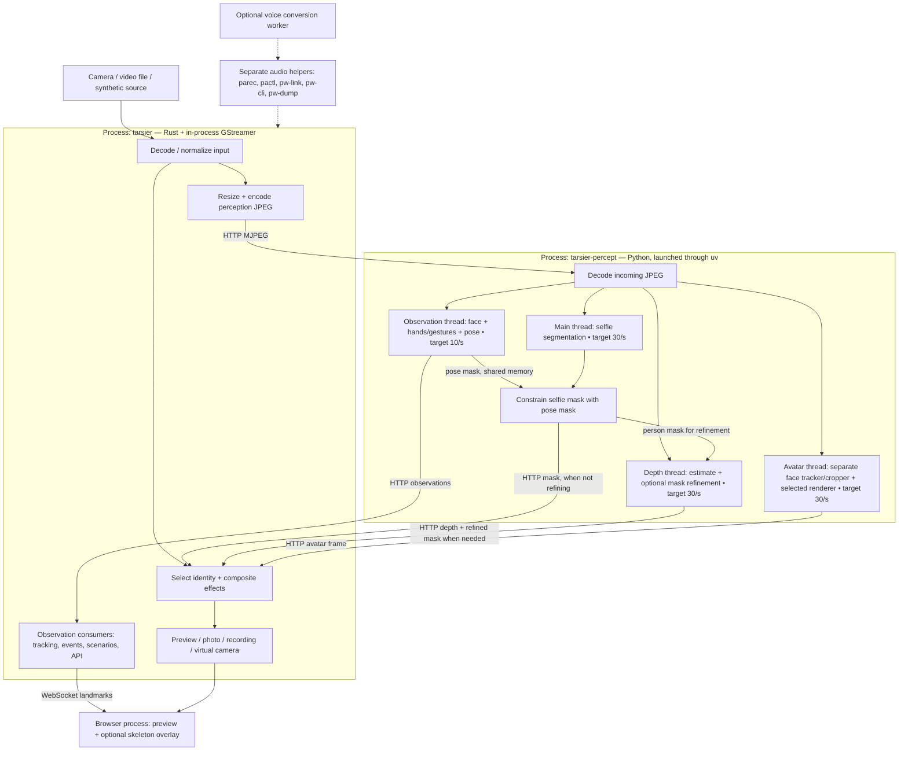
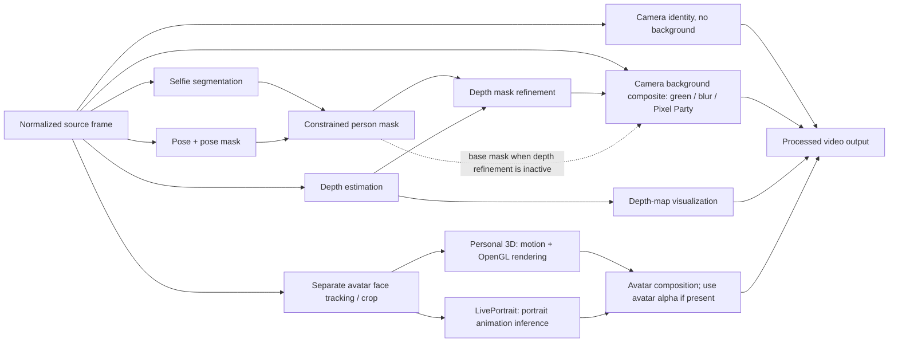

# Effect pipelines and process boundaries

Inspected at commit `54d07ef` (2026-09-10). This describes the current
implementation, followed by candidate demand rules; it does not implement them.
Rates below are the configured targets used in the replay benchmark, not
necessarily achieved throughput.

## Processes and data flow

The models are tasks/threads within one Python process, not one OS process per
model. GStreamer elements also run inside the daemon. Native libraries can start
additional internal threads. `uv` is a launcher; the audio helpers do not become
unnecessary merely because a video effect changes. The browser is a separate CPU
consumer excluded from Tarsier's process totals.

## Effect dependencies

The independent paths in this diagram are dependencies, not claims that all of
them need to run simultaneously. The three camera backgrounds currently share
the same person-mask/depth-refinement dependencies. Depth can be disabled in
configuration; the base constrained mask then supplies the background composite.
An active refiner that cannot produce a valid result must still respect the
existing fail-closed behavior; this is not an unconditional fallback.
The depth-map identity needs the depth estimate, not the selfie or pose masks.

Avatar backgrounds do not consume the camera person mask or request depth
refinement. Where an avatar supplies an alpha mask, green and Pixel Party use
that mask. The current avatar branch treats Blur as a neutral backdrop rather
than applying camera-background blur. The observation face model and the avatar
face tracker/cropper are distinct task instances with different consumers.

## Current work versus effect-only requirements

This table assumes tracking, gesture actions, skeleton display and external
observation consumers are not requesting extra work.

| Task | Plain video | Camera + background | Depth map | Personal 3D / LivePortrait | Current scheduling |
|---|---|---|---|---|---|
| Observation face | Not needed by image effect | Not needed by image effect | Not needed by image effect | Not needed by image effect | Always with observation thread |
| Hands + gesture recognition | Not needed by image effect | Not needed by image effect | Not needed by image effect | Not needed by image effect | Always with observation thread |
| Pose + pose mask | Not needed by image effect | Required by current mask constraint | Not needed by image effect | Not needed by image effect | Always with observation thread |
| Selfie segmentation | Not needed | Required | Not needed | Not needed | Always while worker captures |
| Depth estimation | Not needed | Mask refinement, when configured | Required | Not needed | Already conditional |
| Depth mask refinement | Not needed | When depth is configured | Not needed | Not needed | Already conditional |
| Avatar face + renderer | Not needed | Not needed | Not needed | Selected engine only | Already conditional |
| Perception JPEG transport/decode | Only for other consumers | Required | Required | Required | Present in the current video pipeline |

Depth and avatar loops still receive submitted frames and poll the selected mode
when idle. Their expensive inference is skipped and their engine resources are
closed when unused. This is different from destroying the worker or its threads;
Python/native allocators can also retain memory after an engine is closed.

## Consumers that must participate in demand calculation

- Face tracking and auto-zoom use observation face data and can also use pose.
- Hands tracking and gesture-triggered scenarios need hand observations.
- The phone-near-mouth detector combines face and hand landmarks.
- Face-presence and gesture events are API-visible behavior, including external
  clients; absence of an image effect is not proof that nobody needs them.
- The browser skeleton overlay uses face, hand and pose landmarks. Its toggle is
  currently browser-local, so an explicit backend demand signal is needed before
  using it as a worker scheduling condition.
- Camera-background segmentation requires pose even when skeleton display is off.

A candidate next step is a backend-computed demand set, shared with the worker:
`face`, `hands`, `pose`, `segmentation`, `depth`, `avatar`. Compute it as the union
of effect requirements and enabled/subscribed consumers. Then separate observation
models so unused models can skip inference, pause unused segmentation, and finally
skip perception transport or the entire worker only when the demand set is empty.
Keep capture/output running for plain video. Demand changes must clear stale
results and preserve the current fail-closed mask/output behavior during warmup.
These are proposed optimization rules, not existing behavior.

## Implementation references

- `src/pipeline.rs`: `pipeline_description`, source tee and perception/output branches.
- `src/perception.rs`: worker supervision and CLI arguments.
- `worker/src/tarsier_perception/worker.py`: `MediaPipeDetector.detect`,
  `PoseConstraintStore`, `run`, unconditional observation and segmentation cadence.
- `worker/src/tarsier_perception/avatar.py`: `VideoIdentityClient.depth_usage`,
  `AvatarProcessor._run`, separate avatar tracking and renderers.
- `worker/src/tarsier_perception/depth.py`: `DepthProcessor._run`, conditional
  inference and refinement.
- `src/effects.rs`: `VideoEffects` identity selection and mask composition.
- `src/api.rs`: `perception_observation`, tracking, presence and gesture consumers.
- `web/app.js`: skeleton visibility and landmark consumption.

Measured costs and the private replay data are linked from
[Perception testing](perception-testing.md).
