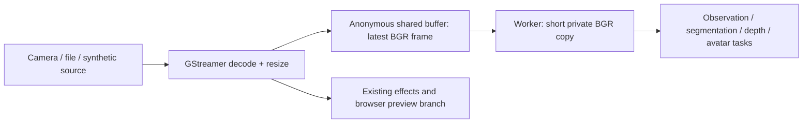

# Local shared-frame perception transport

The supervised perception worker uses `shared-memory` by default on Linux when
`perception.source = "preview"`. The daemon resizes the pre-effect input directly
to the configured perception dimensions and publishes raw BGR pixels. The worker
reads them as a NumPy view and makes a private BGR copy before asynchronous model
threads use the image. This removes the perception JPEG encode/decode round trip;
it does not claim end-to-end zero-copy or GPU-resident transport.



## Selection and compatibility

```toml
[perception]
transport = "shared-memory" # Default; choose "mjpeg" for an explicit comparison.
```

Restart the daemon after changing this setting. Device-source and externally
managed workers keep their existing behavior. The standalone worker accepts a
`shm:///proc/PID/fd/FD#NONCE` source generated by its daemon; that address is valid
only for that daemon lifetime and must not be saved as a camera/video input.

The authenticated `/api/v1/perception/input.mjpeg` endpoint remains available.
In shared-memory mode its JPEG encoding runs only while a client subscribes.
Browser preview, photo and recording paths keep their existing formats. No source
file, microphone setting, inference delegate or effect selection is changed by
choosing this transport.

Telemetry identifies the configured supervised input under
`pipeline_context.perception.input_transport`. `worker_stages.input_copy` measures
shared-frame copy (and resize if needed); `decode` continues to measure
MJPEG decoding. These are elapsed wall times, not per-stage CPU attribution.

## Ownership and synchronization

- The daemon owns one anonymous `memfd`, sized once and sealed against resizing.
  It is mapped read/write in Rust and opened/mapped read-only by the worker via
  the daemon's `/proc/PID/fd/FD` path. Access requires the local OS permissions;
  no shared-frame pathname is exposed through an unauthenticated HTTP endpoint.
- The file has mode 0600 and close-on-exec. No named image file or persistent
  shared-memory segment needs cleanup. Kernel resources disappear when their last
  descriptor/mapping is closed, including on process termination.
- An exclusive `flock` covers producer publication. The producer uses a
  nonblocking lock and drops that frame if the reader is copying, so inference
  cannot hold up camera capture. Invalidating a source takes a short blocking lock.
- The reader takes a shared lock, validates the header and copies the pixels,
  then releases the lock before any inference. Model threads never retain a view
  onto writable shared pixels.
- A nonblocking abstract Unix datagram wakes the single supervised reader. It
  carries no pixels and is not the source of truth: a sequence counter identifies
  new contents. A slow reader skips older frames rather than building a backlog.
  Lost wakeups are covered by a bounded timeout/recheck. A producer that stops
  publishing valid frames causes a reader error after five seconds, allowing the
  existing supervisor to recover.
- A source reset publishes an empty header with a new sequence. Frame IDs may
  reset across source changes, so the transport sequence is independent. Video
  EOF looping retains advancing frame IDs and capture timestamps. Source IDs are
  established upstream of leaky GStreamer branches to avoid startup-order races.

At 640x360, the shared BGR pixel buffer is 691,200 bytes plus a 64-byte header.
The worker's private BGR image is 691,200 bytes; existing asynchronous tasks may
retain their own frame references. The protocol caps shared pixels at 64 MiB.

## Version 1 header

All integers are little-endian. Pixel rows contain packed BGR, with row stride
rounded up to a multiple of four bytes for GStreamer alignment. Any row padding is ignored by the reader.

| Offset | Type | Meaning |
|---:|---|---|
| 0 | 8 bytes | Magic/version: `TARSFRM1` |
| 8 | u32 | Width |
| 12 | u32 | Height |
| 16 | u32 | Row stride, width × 3, rounded up to a multiple of four |
| 20 | u32 | Inference rotation: 0, 90, 180 or 270 |
| 24 | u64 | Publication sequence, advances on clear too |
| 32 | u64 | Source frame ID |
| 40 | u64 | Source capture timestamp in milliseconds |
| 48 | u64 | Pixel length; zero invalidates the latest frame |
| 56 | 8 bytes | Reserved |
| 64 | pixel bytes | BGR image |

The raw path avoids the extra lossy JPEG generation used by the previous
transport. Accordingly, identical replay input does not imply byte-identical
model inputs between the two transports. Check masks, observations and effect
transitions as well as resource usage when comparing them.

## Verification

Rust tests cover writer bytes/provenance, lock contention, invalidation and
lifetime; GStreamer tests cover shared input across file EOF and source changes,
on-demand diagnostic JPEGs, and absence of a perception encoder in the shared
branch. Python tests cover header validation, latest-frame behavior, immutable
consumer copies, source-frame ID reset, resize and reconnect.

See [Perception testing](perception-testing.md) for the replay fixture and measured
performance comparisons.
